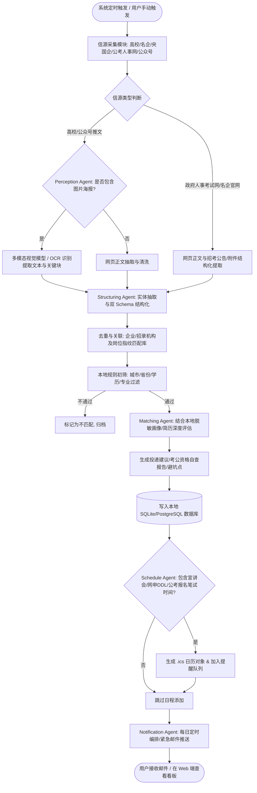
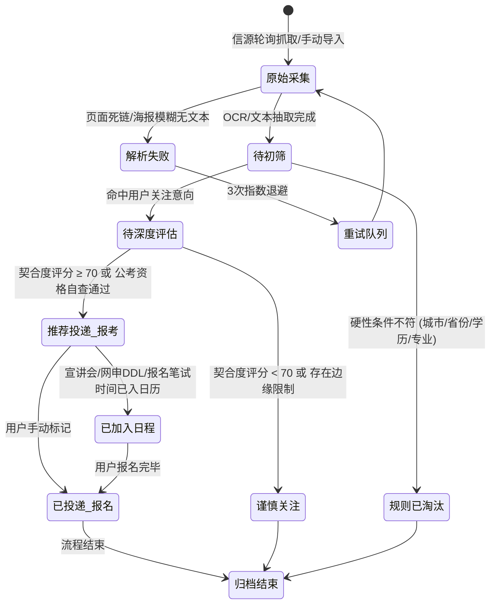
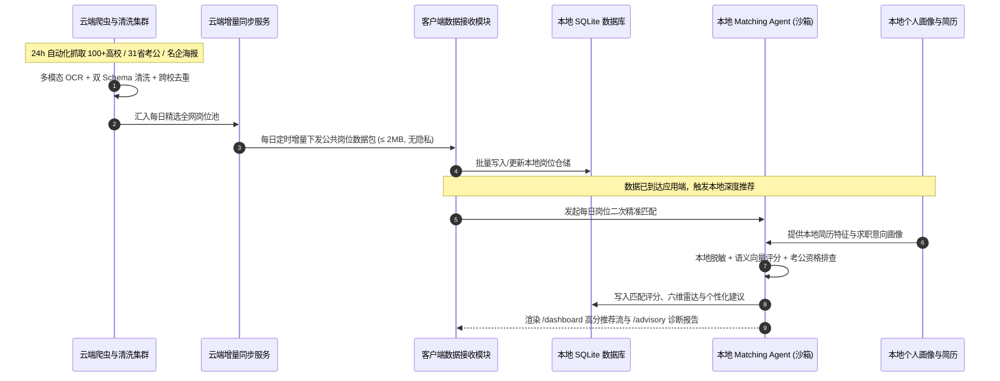
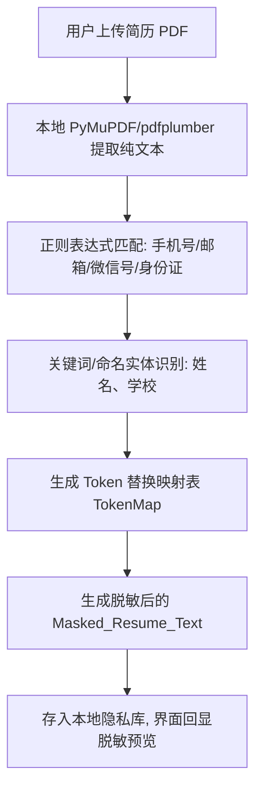
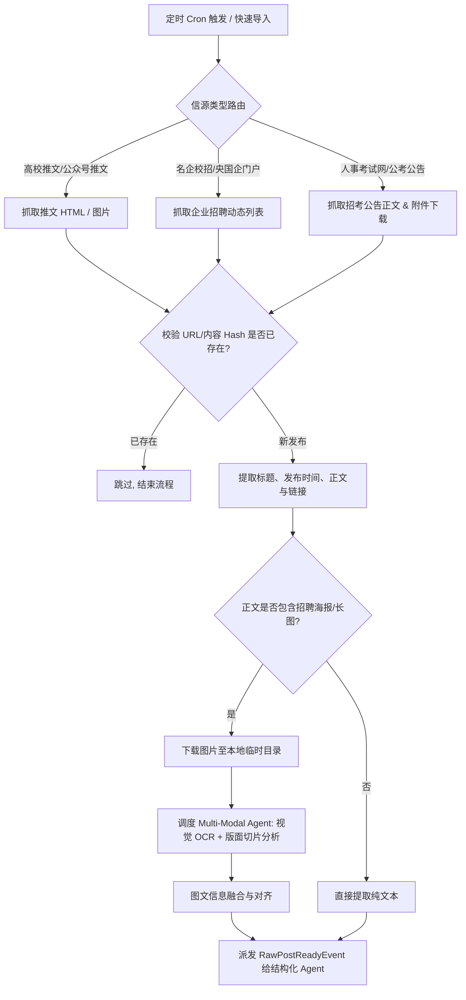

# CampusJob-Agent（高校校招与招考信息智能协同 Agent 系统）产品需求文档（PRD）

**版本号**：V1.3.0  
**状态**：评审版（新增产品形态与付费进阶商业化分级体系）  
**撰写日期**：2026-09-11  

---

## 版本记录表

| 版本 | 日期 | 修订人 | 修订说明 |
| :--- | :--- | :--- | :--- |
| **V1.0.0** | 2026-09-11 | 产品团队 | 初始创建。完成基于多 Agent 协同的高校就业信息聚合、JD 结构化清洗、本地简历脱敏匹配及邮件日程提醒核心 PRD 定义。 |
| **V1.1.0** | 2026-09-11 | 产品团队 | **重大能力扩充**：内置“知名互联网名企直聘 + 央国企招聘门户 + 全国省考/国考/事业单位招考”预设 RSS 信息源矩阵；扩展体制内招考公告抽取 Schema 及“应届生/党员/专业大类”硬性报考资格自查引擎。 |
| **V1.2.0** | 2026-09-11 | 产品团队 | **原型深度对齐与体验升级**：对齐 Stitch 输出的 6 套完整原型系统与 `terminal_high_density_system` 设计规范；升级导航架构（独立 `/tracker` 投递追踪五阶看板、独立 `/advisory` AI 顾问诊断中心、重构 `/settings` 5-Tab 系统控制中心）；确立金融级终端高密度设计语言与暗黄品牌主色。 |
| **V1.3.0** | 2026-09-11 | 产品团队 | **商业化形态与付费进阶体系确立**：制定免费基础版与付费进阶版阶梯体系。明确免费版限定本校+白名单官网并去除 Agent 消耗；明确付费版无限自定义 RSS、云端统一抓取清洗并下发每日精选岗位流、应用端结合隐私本地匹配推荐；新增 2.8 节端云协同商业化架构与分级功能矩阵。 |


---

## 一、概述（为什么做）

### 1.1 产品概述及目标

#### 1.1.1 背景介绍
每年秋招、春招与招考季，高校毕业生面临多赛道并行的求职复杂局面：
1. **多轨并行与信息割裂**：应届生的求职目标往往跨越多个领域——既看**高校就业网/宣讲会**，又关注**头部互联网大厂（腾讯/阿里/字节/华为等）与知名央国企（国家电网/三大运营商/中石化/金融央企等）**的官网直聘动态，同时还高度关注**国家公务员考试（国考）、各省公务员考试（省考）、事业单位招考与选调生公告**；
2. **信息高度碎片化与非结构化**：80% 以上的信息散落在各大高校就业网、微信公众号海报长图、企业招聘官网动态、以及各省人事考试网官方公告中；体制内招考公告往往包含冗长的报考指南和 Excel/PDF 附件，关键信息（报名截止、准考证打印、笔试科目、岗位专业代码限制、党员及应届生硬性门槛）极其分散，极易因漏读错读导致错失报名；
3. **缺乏个性化与噪音极大**：每个同学仅对特定城市、行业、岗位方向或特定省份考公考编信息感兴趣，每天面对数百条跨领域招聘通告，极易发生“信息过载而错过关键投递/报名 DDL”；
4. **隐私顾虑与本地化需求**：应届生在借助 AI 工具分析个人简历契合度与报考资格匹配时，担心将包含姓名、学号、手机号、政治面貌等高度敏感隐私直接暴露给外部不可信云端服务；
5. **决策链路断层**：看到岗位或考编信息后，缺乏针对自身简历/专业背景与报考要求的差距分析和自查指引，宣讲会与报名/笔试节点极易遗漏。

#### 1.1.2 产品概述
**CampusJob-Agent** 是一款面向高校毕业生的本地优先（Local-First）智能化校招与招考协同 Agent 系统。系统通过**多源异步采集与多模态感知 Agent**、**JD/招考公告结构化与本体去重 Agent**、**本地隐私保护与语义契合度匹配 Agent** 以及 **日程编排与邮件通知 Agent**，内置**“高校专场 + 名企直聘 + 央国企 + 公考编制”**多维预设 RSS 信源池，将杂乱的海报、推文及政府招考公告转化为标准化求职流，结合本地脱敏个人画像与简历，每日自动化推送精准求职日报、报名资格预审报告与高优先级日程警报。

#### 1.1.3 产品目标

##### 业务目标
| 目标 | 衡量指标 | 目标值 | 达成时间 |
| :--- | :--- | :--- | :--- |
| **全域信源覆盖** | 内置 985/211 核心高校、Top 互联网企业、核心央国企、全国 31 省市人事考试网预设 RSS 模板 | ≥ 100 个核心高质量预设源 | V1.1 上线时 |
| **高价值信息提取** | 海报长图 OCR 与公考/企招公告关键要素（时间/地点/专业代码/网申或报名链接）抽取准确率 | ≥ 95% | V1.1 上线后 1 个月 |
| **信息降噪率** | 每日推送岗位/招考中，符合用户硬性规则（城市/省份/学历/专业大类/政治面貌）与软偏好的有效信息比例 | ≥ 85% | V1.1 上线后 1 个月 |
| **投递与报名防漏报率** | 用户关注的宣讲会日程、网申截止与公考报名/缴费/准考证打印节点提醒准时率 | 100% | V1.1 发布时 |
| **简历项目背书** | 端到端展示多 Agent 状态机调度、多模态清洗、公考体制内/企业多 Schema 泛化、本地脱敏计算与高质量 Web 后端工程架构 | 满足高规格校招/社招面试答辩要求 | V1.1 交付 |

##### 用户目标
| 目标用户 | 用户目标 | 衡量指标 |
| :--- | :--- | :--- |
| **高校应届求职者** | 告别繁琐翻群查推文和天天刷人事考试网，每天花 5 分钟在邮件或控制台一站式浏览最契合的校招与考编清单 | 每日信息筛选耗时由平均 60 分钟缩短至 5 分钟以内 |
| **求职决策焦虑者** | 既能清晰掌握目标企业 JD 与简历的契合度差距，又能一键自查是否符合公务员/事业单位招考硬性门槛 | 每条推荐岗位附带具体到维度的差距分析报告与报考自查清单 |

#### 1.1.4 目标用户画像
| 角色 | 特征描述 | 核心诉求 |
| :--- | :--- | :--- |
| **高校应届毕业生（本/硕/博）** | 处于秋招/春招冲刺期，目标明确或正在探索岗位匹配 | 快速掌握本校及周边重点高校的宣讲会、名企直签信息，绝不漏掉 DDL |
| **体制内/公考/事业单位考编考生** | 重点关注国考、目标生源地省考、选调生招录、高校与科研事业单位招考 | 实时监控各省人事考试网公告发布，自动提取专业目录限制与报名时间窗口 |
| **名企/央国企定向投递者** | 瞄准高含金量央企（电网/烟草/石油/军工）及互联网头部大厂 | 第一时间掌握提前批与常规校招批次网申入口、内推码与宣讲排期 |
| **跨专业/复合求职者** | 偏好明确（如特定省份城市、特定技术栈、体制内外双线准备） | 自动化规则与语义匹配，坚决过滤掉无关杂讯 |

---

### 1.2 名词说明

| 名词 | 全称 / 英文 | 详细说明 |
| :--- | :--- | :--- |
| **Agentic Workflow** | Agentic 工作流 | 指通过多 Agent 协同（规划、反思、工具调用），完成复杂的非结构化信息清洗与决策闭环。 |
| **JD** | Job Description | 招聘岗位描述，包含岗位职责、任职要求、薪资、地点、学历与专业要求。 |
| **Local-First** | 本地优先原则 | 用户隐私数据（完整简历、联系方式、模糊偏好配置）仅驻留在本地，外发推理时进行严格本地正则与命名实体脱敏（NER）。 |
| **RSS / RSSHub** | Rich Site Summary | 信息源聚合协议。通过 RSSHub 或专用抓取适配器将微信公众号、高校就业网动态转化为标准化 XML/JSON 数据流。 |
| **ICS** | iCalendar (RFC 5545) | 通用日历文件标准格式，支持一键导入系统日历（如 Apple Calendar、Outlook、Google Calendar）。 |
| **LLM JSON Schema** | 结构化约束输出 | 强制大语言模型按照预设的 Pydantic 结构化模型输出有效 JSON，避免幻觉与解析崩溃。 |

---

### 1.3 角色及权限体系（免费版 vs 付费版）

| 角色 | 版本归属 | 权限与信源能力范围 | 数据与隐私范围 |
| :--- | :--- | :--- | :--- |
| **免费基础版用户 (Free Tier)** | 免费基础版 | • 仅限绑定并配置本校就业服务网（1 所）<br>• 仅限访问预设的 3~5 家核心名企官网及主要省份考公官方白名单<br>• 基础文本抓取与关键词过滤，无多 Agent 深度解析与契合度诊断<br>• 基础定时邮件清单推送，不可自定义添加外部 RSS 源 | 纯本地单机运行与存储，零云端交互，无任何服务器计算成本 |
| **付费高级版用户 (Pro Tier)** | 付费订阅版 | • **无限量自主配置**全网任意 RSS、公众号与外部招聘源<br>• **云端每日推送“精选高价值岗位池”**（免去本地爬虫维护与反爬阻碍）<br>• **端侧全量 Agent 决策**：简历契合度 0-100 打分、六维能力雷达、名企面试押题、公考报名资格硬性排查<br>• 智能日程编排（.ics 双向同步）与推文/海报极速 OCR 工具箱 | 遵循 Local-First 原则：云端仅单向推送公共岗位数据；简历、画像与个性化匹配 100% 封闭在本地沙箱计算 |


---

### 1.4 文档阅读对象

| 阅读对象 | 关注重点 |
| :--- | :--- |
| **后端开发工程师** | 异步任务队列（Celery/APScheduler）、多 Agent 调度流水线、数据库 Schema 设计、本地脱敏算子与邮件发送服务 |
| **AI / 算法工程师** | Prompt 编排、多模态 OCR + 视觉模型抽取规范、Embedding 混合检索与简历打分决策逻辑 |
| **前端开发工程师** | Web 控制台交互、仪表盘（Dashboard）、岗位详情与简历匹配差距展示面板、日历视图 |
| **测试工程师** | 信源解析失败重试、极端非结构化长图文本异常、并发解析容错与邮件推送边界测试 |

---

## 二、产品描述（做什么）

### 2.1 产品需求描述
系统划分为五大核心业务域：
1. **本地配置与隐私空间（Preference & Privacy Engine）**：管理用户求职意向（目标城市/省份、专业类别、企业类型红黑名单、政治面貌、应届生标识）、上传并解析本地简历，提供敏感信息自动脱敏映射表。
2. **多模态信源感知与采集（Perception & Extraction Agent）**：
   - **预设全域 RSS 信源矩阵库**：开箱即用内置四大分类源（① 核心 985/211 高校就业网；② 头部互联网名企官网直聘；③ 核心央国企招聘门户；④ 国家及 31 省市人事考试/公考网）；
   - **自动化采集调度**：定时监控上述 RSS 源及微信公众号，支持手动单篇链接/长图海报即时解析；调度 OCR 引擎与视觉模型解析招聘海报。
3. **JD 与招考结构化清洗与本体去重（Structuring & Deduplication Agent）**：将清洗后的图文与政府招考公告转为规范化实体（企业校招 `JobPosting` 与 体制内 `CivilServicePosting` 双 Schema 支持），基于组织机构名称与岗位指纹消除跨渠道重复发布。
4. **契合度推演与报考资格自查（Matching & Advisory Agent）**：
   - **企业岗位**：比对目标 JD 与脱敏简历，计算匹配得分，生成“优势亮点、短板缺陷、简历微调建议”；
   - **公考编制**：执行硬性报名门槛排查（政治面貌、应届生限制、学历门槛、专业目录对齐），给出报考合规性判定与笔试备考建议。
5. **日程编排与邮件触达（Schedule & Notification Agent）**：自动提取宣讲会、网申截止、公考报名窗口、准考证打印及笔试时间，每日定时汇总并发送结构化《每日求职精要简报》及《紧急 DDL 预警》邮件。

---

### 2.2 产品整体流程

#### 2.2.1 整体业务主流程图



#### 2.2.2 简历匹配与隐私脱敏子流程图

```mermaid
flowchart LR
    subgraph 本地安全沙箱 [本地安全沙箱 (Local Sandbox)]
        ResumePDF[用户上传原始简历 PDF] --> ParseText[本地文本与版面提取]
        ParseText --> MaskEngine[本地脱敏算子: 正则 + 本地轻量 NER]
        MaskEngine --> TokenMap[(本地脱敏映射表: 姓名/手机/学号/公司)]
        MaskEngine --> MaskedResume[脱敏后简历特征文本]
    end

    subgraph 决策推理层 [云端/远端 LLM 推理层]
        JDData[标准化 JD / 招考数据] --> PromptEngine[Prompt: 契合度推演与资格自查]
        MaskedResume --> PromptEngine
        PromptEngine --> LLMEval[大语言模型评估]
        LLMEval --> RawAdvice[包含脱敏代号的评估结果]
    end

    subgraph 本地还原 [本地还原层]
        RawAdvice --> DeMask[结合 TokenMap 还原个性化建议]
        TokenMap --> DeMask
        DeMask --> FinalReport[呈现最终投递指导报告]
    end
```

#### 2.2.3 岗位生命周期状态机图（STD）



---

### 2.3 全局说明

#### 2.3.1 全局异常处理规则

| 异常场景 | 触发机制 | 业务处理策略 | 用户提示 / 兜底行为 |
| :--- | :--- | :--- | :--- |
| **信源网络超时/死链** | 连续 3 次 HTTP 5xx 或连接超时（单次阈值 15s） | 自动进入失败重试队列，采用指数退避（1m, 5m, 15m）；超过上限标记为 `源失效` | 控制台源管理列表中标红警告；不中断其他信源流水线 |
| **政府考试网附件下载失败** | 考试公告正文仅为通知，详细岗位表为 .xlsx/.pdf 附件外链 | 调度异步下载附件提取模块，若外链失效则提示用户查看原文 | 标明“附件待查”，保留直达原文链接入口 |
| **海报完全无法解析** | 图片严重失真、手写字或纯插画无文字 | 判定为解析异常，保存原图链接与基础来源上下文 | 标记为“人工待核”，在界面保留“原图预览+手动补充”按钮 |
| **LLM 结构化解析幻觉** | 返回格式未通过 Pydantic 校验或 JSON 语法损坏 | 自动将错误信息作为 Prompt 反馈，触发一次 Self-Correction（自我修正修复） | 若二次修复仍失败，降级为全文摘要存储，不阻塞流水线 |
| **SMTP 邮件服务失败** | 用户配置授权码错误、端口阻断或配额限制 | 捕获 SMTPException，写入系统告警日志 | Web 控制台顶部 Toast 警告：“邮件发送失败，请检查 SMTP 配置” |

#### 2.3.2 列表与展示规则
1. **岗位与招考流卡片列表**：
   - 支持顶部 Tab 切换查看：`【全部】`、`【企业校招】`、`【央国企专区】`、`【公考编制】`；
   - 默认按 `匹配度/推荐度降序` 排序，支持切换 `按发布时间倒序` 或 `按截止日期临近度升序`；
   - 列表顶部常驻统计卡片：`今日新增招考总数`、`高匹配推荐数`、`近3天报名/宣讲日程`。
2. **标签规范**：
   - 性质标签：互联网大厂 / 核心央企 / 地方国企 / 国家公务员 / 地方省考 / 事业单位 / 选调生；
   - 匹配度色阶：≥85分（绿色-强烈推荐/资格完全符合）、70~84分（蓝色-良好推荐/基本符合）、60~69分（黄色-谨慎尝试/含不确定项）、<60分（灰色-弱相关）。

#### 2.3.3 全局交互与反馈
- **本地敏感信息可见性**：界面上的姓名、电话、政治面貌默认支持“眼球图标”一键脱敏预览；
- **异步操作反馈**：执行“全量信源即时更新”或“批量岗位匹配”时，右下角弹出任务抽屉进度条（SSE 实时展示当前解析源与推文进度）。

---

### 2.4 产品版本规划（里程碑）

| 版本 | 阶段定位 | 核心发布内容 | 预期周期 |
| :--- | :--- | :--- | :--- |
| **V1.0.0 (MVP)** | Web 全栈基础版 | 1. 基础配置（本地偏好+简历解析+脱敏沙箱+SMTP邮箱）<br>2. 核心高校就业网与微信公众号推文采集与 OCR<br>3. 企业校招多 Agent 结构化与去重<br>4. 简历匹配度与建议生成<br>5. 邮件每日精要推送与 .ics 日历导出 | 4 周 (已完成) |
| **V1.1.0** | 矩阵信源与公考强化版 | 1. **全域预设信源中心**：内置知名互联网企业、核心央国企招聘门户及全国各省人事考试网 RSS 订阅库<br>2. **公考编制双 Schema 引擎**：支持公务员/事业单位招考公告与附件岗位表解析<br>3. **公考报名资格自查**：支持应届生/党员/专业大类硬性报考条件校验<br>4. FastAPI 异步后端与自动化测试体系落地 | 3 周 (已完成) |
| **V1.2.0** | 高保真终端原型与体验重构版 | 1. **金融级高密度终端设计系统 (Terminal High-Density System)**：确立明黄主色与等宽数字对齐标准<br>2. **全功能六大工作台**：`/dashboard` 宏观大盘、`/jobs` 双模态岗位抽屉、`/tracker` 五阶段投递泳道、`/calendar` 70/30 双栏交互日历、`/advisory` 六维雷达与实战押题、`/settings` 5-Tab 系统设置与表单脏值保护<br>3. **前后端接口对齐**：全量对齐 REST API 与组件数据协议 | 2 周 (已完成) |
| **V1.3.0** | 商业化分级与端云协同版 | 1. **版本边界落地**：实施免费版（本校+白名单官网、零 Agent、基础推送）与付费版（无限 RSS、云端精选池、端侧 Agent 决策）权限拦截<br>2. **云端精选岗位同步管道**：云端统一采集清洗，每日向付费端推送增量高价值岗位流，客户端本地结合私有简历进行无感二次匹配推荐<br>3. **转化引导与订阅管理**：在信源配置与 AI 诊断处提供轻量升级引导，保障 Local-First 隐私护城河 | 2 周 (当前演进) |
| **V2.0.0** | 本地桌面客户端 (Tauri/Native) | 采用 Tauri / 原生 WebKit 极轻量桌面客户端，集成端侧轻量模型（Ollama / Qwen2.5），支持完全离线端侧深度推理 | 远期规划 |


---

### 2.5 产品逻辑与端云协同架构图

```
┌──────────────────────────────────────────────────────────────────────────────────────────────────┐
│                                 【云端服务中心 (Cloud SaaS Platform)】                              │
│  全网多源异步爬虫引擎 (100+高校 / 31省公考 / 央国企)  ──►  多模态 OCR 矩阵  ──►  双 Schema 清洗与去重  │
│                                                                        │                         │
│                                                                        ▼                         │
│                                                       [(每日全网精选高价值岗位池)]                  │
│                                                                        │ 每日增量同步 (仅公开数据)  │
└────────────────────────────────────────────────────────────────────────┼─────────────────────────┘
                                                                         │
═════════════════════════════════════════════════════════════════════════╪═════════════════════════════════
                                                                         │ 网络下行 (单向同步，无反向隐私上报)
┌────────────────────────────────────────────────────────────────────────▼─────────────────────────┐
│                               【本地客户端运行环境 (Client Local Sandbox)】                         │
│                                                                                                  │
│  ┌─────────────────────────────────┐                       ┌──────────────────────────────────┐ │
│  │   [免费基础版链路 (Free Tier)]   │                       │   [付费高级版链路 (Pro Tier)]    │ │
│  │ • 仅限绑定本校就业网 (1所)       │                       │ • 云端每日精选岗位增量同步接收器 │ │
│  │ • 仅限预设核心大厂/公考白名单    │                       │ • 无限量自定义外部 RSS/公众号配置│ │
│  │ • 本地单机轻量直接轮询抓取      │                       │ • 客户端本地 SQLite 数据库仓储   │ │
│  │ • 基础关键字初筛，无 Agent 智能 │                       │                                  │ │
│  │ • 基础每日邮件列表发送           │                       │                                  │ │
│  └─────────────────────────────────┘                       └─────────────────┬────────────────┘ │
│                                                                              │                  │
│                                ┌─────────────────────────────────────────────▼───────────────┐  │
│                                │             客户端本地 Agent 协作与隐私决策引擎             │  │
│                                │ ┌───────────────────────────┐ ┌───────────────────────────┐ │  │
│                                │ │ 1. 本地脱敏安全沙箱       │ │ 2. Matching & Advisory    │ │  │
│                                │ │    (简历原文/隐私不出设备)│ │    (0-100契合度/六维雷达) │ │  │
│                                │ └─────────────┬─────────────┘ └─────────────┬─────────────┘ │  │
│                                │               │                             │               │  │
│                                │ ┌─────────────▼─────────────┐ ┌─────────────▼─────────────┐ │  │
│                                │ │ 3. 公考资格硬性排查引擎   │ │ 4. Schedule & Action Agent│ │  │
│                                │ │    (专业大类/应届/党员)   │ │    (ICS 双向同步/DDL预警) │ │  │
│                                │ └───────────────────────────┘ └───────────────────────────┘ │  │
│                                └─────────────────────────────────────────────────────────────┘  │
│                                                                                                  │
│  ┌────────────────────────────────────────────────────────────────────────────────────────────┐  │
│  │                                   前端高密度终端交互层 (Web Console)                       │  │
│  │  [📊仪表盘 /dashboard]  [💼岗位流 /jobs]  [📅日程 /calendar]  [🎯追踪 /tracker]  [🤖顾问 /advisory]│  │
│  └────────────────────────────────────────────────────────────────────────────────────────────┘  │
└──────────────────────────────────────────────────────────────────────────────────────────────────┘
```

---

### 2.6 核心功能清单与版本权限矩阵

| 模块编码 | 模块名称 | 功能点 | 版本权益 | 优先级 | 所属页面 / 路由 | 功能简述与权益边界 |
| :--- | :--- | :--- | :--- | :--- | :--- | :--- |
| **M1** | 偏好与隐私 | 1.1 核心求职意向与考公画像 | **全员免费** | P0 | `/settings` (Tab 1) | 配置城市/省份、岗位方向、学历层次、政治面貌、毕业届数 |
| **M1** | 偏好与隐私 | 1.2 本地简历脱敏沙箱检视器 | **全员免费** | P0 | `/settings` (Tab 1) | 本地解析 PDF 简历，左右对照，已拦截敏感实体展示及白名单控制 |
| **M2** | 采集与感知 | 2.1 基础信源配置（本校+白名单） | **全员免费** | P0 | `/settings` (Tab 2) | 支持 1 所本校就业网 + 3~5 家核心公司官网 + 主要省考官网抓取 |
| **M2** | 采集与感知 | 2.2 **无限自主 RSS 与全域信源库** | **Pro 付费** | P0 | `/settings` (Tab 2) | **付费专属**：无限量添加外链 RSS、公众号；解锁 100+ 预设信源池 |
| **M2** | 采集与感知 | 2.3 **云端每日精选岗位池直推** | **Pro 付费** | P0 | 后台同步服务 | **付费专属**：服务器集中清洗推送全网高价值岗位，免除本地爬虫运维 |
| **M2** | 采集与感知 | 2.4 极速解析推文/海报组件 | **差异化** | P0 | 全局 Header / Modal | **免费版**：每月 3 次试用；**Pro 版**：无限次极速长图 OCR 结构化提取 |
| **M3** | 结构化去重 | 3.1 实体抽取与双 Schema 打标 | **Pro 付费** | P0 | 后台 Agent 流水线 | 免费版仅抓取原始标题与摘要；Pro 版完整提取详细职责/代码并去重 |
| **M4** | 匹配与决策 | 4.1 岗位详情与 AI 契合度评估 | **差异化** | P0 | `/jobs` (Drawer) | **免费版**：查看基础 JD；**Pro 版**：0-100 简历匹配打分与修改词建议 |
| **M4** | 匹配与决策 | 4.2 AI 求职顾问与决策中心 | **Pro 付费** | P0 | `/advisory` | **付费专属**：六维能力分析雷达、名企面试押题、公考报名资格硬性自查 |
| **M5** | 进程跟踪 | 5.1 投递追踪全链路看板 | **差异化** | P0 | `/tracker` | **免费版**：支持基础已投标记；**Pro 版**：五阶段可视化泳道与 DDL 预警 |
| **M6** | 日程与提醒 | 6.1 交互式日历工作台与 ICS 同步 | **Pro 付费** | P0 | `/calendar` | **付费专属**：70/30 双栏日历、宣讲会与报名 DDL 提取、一键导出 .ics |
| **M6** | 日程与提醒 | 6.2 邮件通知早报服务 | **差异化** | P0 | `/settings` (Tab 4) | **免费版**：基础岗位文本列表；**Pro 版**：智能高契合度精要早报 + 附件日历 |
| **M7** | 系统安全 | 7.1 本地凭据加密与存储管理 | **全员免费** | P0 | `/settings` (Tab 5) | SQLite 物理管理、临时海报缓存一键清理、AES 主密钥轮转 |


---

### 2.7 产品原型设计与界面交互规范约束（Stitch 高保真原型规范）

本节严格依据 `stitch_graduate_career_hub` 输出的完整高保真原型、6 大页面代码（`_1`~`_4`, `ai`, `settings`）以及 `terminal_high_density_system` 设计系统规范，对系统的界面架构、色彩系统、字体层次、页面路由与交互行为做出精确约束。

#### 2.7.1 视觉设计系统与设计令牌（Design Tokens）

基于 **金融级高密度终端设计系统（Terminal High-Density System）**，兼顾高信息吞吐与极速视觉辨识：

##### 1. 色彩语义系统（Color Tokens）
```yaml
品牌与操作核心:
  primary: "#fcd535"              # Binance/Terminal 经典明黄 (主 CTA、高亮边框、关键焦点)
  primary-hover: "#f0b90b"        # 悬浮态
  primary-container: "#fefce8"    # 明黄柔光容器底色
  on-primary: "#181a20"           # 按钮文字极深深灰 (保持绝对高对比度)

画布与表面 (Canvas & Surfaces):
  background: "#f8fafc"           # 默认底色 (Slate-50)
  surface: "#ffffff"              # 卡片主表面 (纯白)
  surface-card: "#ffffff"         # 卡片表面
  surface-elevated: "#f1f5f9"     # 悬浮与嵌套容器底色 (Slate-100)
  hairline: "#e2e8f0"             # 浅色分割线 (Slate-200)
  hairline-strong: "#cbd5e1"      # 强调分割线与边框 (Slate-300)

文字层次 (Typography Colors):
  text-primary: "#0f172a"         # 主标题与强调数据 (Slate-900)
  text-body: "#334155"            # 正文文本 (Slate-700)
  text-muted: "#64748b"           # 次级辅助说明 (Slate-500)
  text-muted-strong: "#475569"    # 中度强调说明 (Slate-600)

状态与业务语义色 (Status Semantics):
  status-urgent (DDL/临界): "#ef4444" / "#b91c1c" (底色 #fef2f2, 边框 #fecaca)
  status-success (完全符合/Offer): "#10b981" / "#047857" (底色 #f0fdf4, 边框 #bbf7d0)
  status-info (宣讲会/初筛): "#3b82f6" / "#1d4ed8" (底色 #eff6ff, 边框 #bfdbfe)
  status-exam (笔试/准考证): "#10b981" / "#15803d" (底色 #f0fdf4, 边框 #bbf7d0)
  status-career (双选会/直通): "#8b5cf6" / "#6d28d9" (底色 #faf5ff, 边框 #e9d5ff)
```

##### 2. 排版与字体层次（Typography Hierarchy）
- **正文字体**：`Inter, -apple-system, BlinkMacSystemFont, "Segoe UI", sans-serif`，清晰严谨；
- **数字与代码字体**：`JetBrains Mono, "SF Mono", monospace`（类名 `.font-mono-num`），所有评分（`92`）、时间（`08:00`）、薪资（`22k-38k`）、统计数（`18`）必须统一采用等宽字体，保证垂直排版完全对齐；
- **微交互圆角**：卡片采用 `rounded-md` (6px) 或 `rounded-xl` (12px)，按钮采用 `rounded-lg`，Chip 采用 `rounded-full` 或 `rounded` (4px)。

---

#### 2.7.2 统一顶部导航栏规范（Global Shell Header）

在所有 6 大主页面（`_1`~`_4`, `ai`, `settings`）中，顶部常驻高度为 **56px (h-14)** 的吸顶全局 Header，结构严格统一：

```
┌────────────────────────────────────────────────────────────────────────────────────────────────────────┐
│ [Logo] [仪表盘] | [看板 /jobs]  [日历日程 3待办]  [投递追踪 🟢]  [AI顾问诊断 💡] | [🔍全局搜索 ⌘K] [+解析推文] [🔔] [研 用户设置⚙️] │
└────────────────────────────────────────────────────────────────────────────────────────────────────────┘
```
1. **左侧 Brand & 导航区**：
   - 品牌入口胶囊：明黄色按钮 `[仪表盘 /dashboard]`（点击随时返回总览大屏）；
   - 五大常驻模块导航链接：
     - `看板 /jobs`：图标 `dashboard`；
     - `日历日程`：图标 `calendar_month`，附带待办气泡 Badge（`3待办`）；
     - `投递追踪`：图标 `near_me` / `track_changes`，附带动态绿脉冲（`🟢`）；
     - `AI顾问诊断`：图标 `psychology` / `smart_toy`，高亮底色与微边框；
2. **右侧全局操作与状态区**：
   - **全局极速搜索框**：支持快捷键 `⌘K` / `Ctrl+K`，支持企业、岗位、城市、岗位代码模糊检索；
   - **主操作按钮**：明黄色高亮 `[+ 解析推文/海报]`，随时唤起单篇 URL 与海报 OCR 解析弹窗；
   - **未读消息铃铛**：带小红点，展示 48h 临界 DDL 报警；
   - **用户画像与设置胶囊（Profile Capsule）**：展示考生属性徽章（`研 2027届 硕士 | 计算机工学 · 党员`），点击唤起设置下拉菜单或直达 `/settings`。

---

#### 2.7.3 核心页面线框架构与交互功能规格

##### 页面一：求职与考公总览仪表盘 (`/dashboard` - Prototype `_1`)
- **定位**：全域宏观掌控中心，快速通览今日新增动向、趋势图表与紧急待办。
- **页面结构**：
  1. **顶部 4 大核心 KPI 指标卡**：
     - `今日全网新增招考`: `128` 条（高校推文 62 / 名企直聘 38 / 招考 28）；
     - `高契合度推荐`: `12` 个（企招 8 / 公考合规 4）；
     - `72h 内紧急截止`: `03` 项（红字高亮预警）；
     - `监控信源运行健康度`: `24` 个活跃源（100% 连通）；
  2. **中区双图表联动**：
     - 左栏：近 14 天新增招考走势对比折线图（企招 vs 考公双曲线，支持 7D / 14D / 30D 切换）；
     - 右栏：意向命中与分布（按意向城市：杭州 45%、上海 30%、省直 25%；按行业大类：大厂 40%、央企 35%、公考 25%）；
  3. **下区双流推荐**：
     - 左栏：今日高匹配推荐（Top 5 卡片流，带契合度得分、企业性质、一键加入日历、查看自查报告）；
     - 右栏：近期关键日程与宣讲排期（宣讲会、网申 DDL、笔试节点，带倒计时与校区标识）。

---

##### 页面二：招考看板与全域岗位流 (`/jobs` - Prototype `_2`)
- **定位**：岗位检索、组合筛选、批量操作与双模态详情抽屉承载区。
- **页面结构与组件**：
  1. **顶部多维过滤栏**：
     - 赛道 Tab：`全部 (342)` | `企业校招 (210)` | `央国企直聘 (78)` | `国家/地方公务员 (34)` | `事业单位/科研 (20)`；
     - 快捷条件：意向城市多选、学历要求、应届限定、最低匹配分滑块（≥60）、仅看党员岗位；
     - 排序方式：`匹配优先 (降序)` / `DDL临近优先 (升序)` / `最新发布优先`；
     - 视图切换：卡片瀑布流 vs 密集数据表格。
  2. **双模态岗位详情抽屉 (`#job-detail-drawer`, 宽 680px)**：
     - **企招模态 (`drawer-content-corporate`)**：左栏展示薪资待遇、职责任职要求、宣讲会校区；右栏展示 AI 匹配亮点（Highlights）、短板差距（Gaps）、简历润色替换建议、二面押题；
     - **公考招考模态 (`drawer-content-public`)**：顶部横幅高亮展示【四重资格审验结果】（`应届生限定`、`政治面貌`、`专业大类`、`学历门槛`）；展示岗位代码、招考人数、报名窗口倒计时、笔试科目、服务期限制；
     - **底部固定动作条**：`[加入日历]`、`[标记为已投递]`、`[直达官方报名/网申入口]`。

---

##### 页面三：五阶段全链路投递追踪看板 (`/tracker` - Prototype `_3`)
- **定位**：求职全生命周期管道化管理，杜绝漏考、忘面、错过政审。
- **页面结构**：
  1. **顶部 4 项追踪大盘指标**：
     - `总追踪事项`: `18` 项（企招 11 / 体制内 7）；
     - `紧急待处理节点`: `04` 个（招行笔试 <4.5h、明午面试、2 项选岗截止）；
     - `初筛与入围率`: `63.6%`（企招 7/11 入围，选调初审 100% 通过）；
     - `已录用意向 / Offer`: `01` 份底牌锁定；
  2. **五阶段看板泳道（Five-Stage Kanban Columns）**：
     - **列 1：已网申 / 待初审**（记录投递批次、简历版本、初审状态）；
     - **列 2：笔试阶段 (机试/行测)**（带牛客/机试双机位准备提示、倒计时、启动刷题沙箱按钮）；
     - **列 3：面试阶段 (专业/结构化)**（带面试轮次、HR 电话、模拟追问跳转）；
     - **列 4：体检 / 政审 / 考察**（公考选调差额政审与央企背景调查节点）；
     - **列 5：意向录用 / Offer / 公示**（录用通知、薪资包比对、三方协议签署截止日）。

---

##### 页面四：70/30 双栏交互式日历工作台 (`/calendar` - Prototype `_4`)
- **定位**：日历化排程调度、多通道视图与入场凭证中心。
- **页面结构**：
  1. **顶部状态栏与切换器**：
     - 4 项日程卡片（本月重要 DDL 14 场、今日待办 3 项、宣讲会 9 场、笔试环境锁定 4 场）；
     - 月度翻页与 `[回到今天]` 按钮；
     - 视图切换：`月视图 (Month)` / `周视图 (Week)` / `日程清单 (Agenda)`；
     - 四大语义色过滤器：🔴 网申/公考 DDL、🔵 线下宣讲、🟢 统一笔试/准考证、🟣 双选会/初面；
  2. **70/30 双栏交互格局**：
     - **左侧 70%：35 格网格月历**（按农历与公历双行排布，单元格高亮当前日期，事件 Chip 颜色编码，点击直接穿透）；
     - **右侧 30%：今日日程与详情面板**：
       - `今日日程清单`（时间轴步进展示 10:00 阿里截止、14:30 华为宣讲、19:00 招行机试）；
       - `体制内与公考关键里程碑`（国考公告倒计时、浙江省考报名窗口倒计时）；
       - `宣讲会入场凭证卡`（自动生成校区教室导航路线与电子签到二维码/凭证编号）；
       - `一键订阅外部日历`（提供本地 Webcal / ICS 订阅链接）。

---

##### 页面五：AI 求职顾问诊断与决策中心 (`/advisory` - Prototype `ai`)
- **定位**：基于本地脱敏简历的深度智能分析大脑与实时求职 Copilot。
- **三栏式决策工作台布局（28% : 44% : 28%）**：
  1. **左栏（28%）：个人能力模型与沙箱**：
     - **六维能力剖析雷达图**：专业背景匹配 (95%)、项目工程落地 (92%)、体制合规准入 (100%)、面试表达胜率 (82%)、笔试应试储备 (78%)、双轨精力分配健康度 (75%)；
     - **画像沙箱卡片**：展示 12 项本地敏感实体掩蔽状态；
     - **双轨精力分配监控**：名企秋招 55% vs 体制考公 45%，带动态调优建议；
  2. **中栏（44%）：结构化诊断卡片流**：
     - Tab 筛选：`全部诊断 (12)` | `头部名企 (6)` | `公考与选调 (4)` | `面试避坑 (2)`；
     - **名企差距诊断卡**：匹配评分（如 92 分）、核心优势亮点（Highlights）、劣势与技术盲区（Gaps）、AI 润色即拷即用替换块；
     - **公考硬性资格穿透卡**：4 项资格审验 100% 符合卡、重大招录备注（最低服务期 5 年）、进面分数线预警（142.5分）与备考策论金句；
     - **实战押题与情景预测卡**：淘天二面 91% 概率必考点（双写一致性/Seata脏写）、银行机考 ACM 模式陷阱；
  3. **右栏（28%）：实时 AI 求职助手（Workbench Copilot）**：
     - 快捷指令推荐（二面压问、报考胜率测算、项目措辞一键润色）；
     - 多轮问答会话区（支持关联目标岗位 JD，流式打字机输出解答）。

---

##### 页面六：系统全局设置与工作台控制中心 (`/settings` - Prototype `settings`)
- **定位**：系统配置与本地安全总控，采用二级标签导航结构（5 个 Tab）。
- **Tab 架构详情**：
  1. **Tab 1: 求职画像与本地隐私脱敏沙箱 (`profile`)**：
     - 核心求职意向与考公资格排查表单（学历层次、毕业年份应届生校验、政治面貌、意向城市、行业黑名单）；
     - **双屏高保真简历脱敏检视器**：左侧本地明文只读缓存（张三、13800138000、浙江大学），右侧大模型推理脱敏视图（所有敏感项被黄色 `[CANDIDATE_NAME]`、蓝色 `[PHONE_1]`、绿色 `[UNIVERSITY_1]` 替换）；
     - 脱敏白名单配置（支持技术专有名词保护）；
  2. **Tab 2: 全域信源采集网络配置 (`sources`)**：
     - 全局抓取策略：轮询周期选择（推荐每 30 分钟）、超时与指数退避规则、微信公众号防盗链代理模式；
     - 已激活信源监控清单（内置 128 个预设源矩阵，当前激活 24 个，支持各源单独启闭开关与一键存活心跳探测）；
  3. **Tab 3: 多 Agent 智能协同流水线与模型配置 (`agents`)**：
     - 4 大 Agent 状态展示（Perception、Structuring、Matching、Schedule）；
     - 大模型服务商接入：DeepSeek API、阿里百炼、本地 Ollama (Qwen-2.5-14B)、OpenAI；
     - API Base URL、本地 AES 加密 API Key、温度与 MaxTokens 调优；
  4. **Tab 4: 邮件通知通道 (SMTP) 与 .ics 日历编排 (`notifications`)**：
     - SMTP 服务器（`smtp.qq.com` / 端口 465 SSL）、发信账号与 16 位授权码、目标接收邮箱；
     - 每日早报定时触发时间（默认 `08:00`）、早报 4 大构成模块勾选、低匹配度静默免打扰开关；
     - 外部日历本地订阅 URL：`http://127.0.0.1:8000/feed/calendar.ics`；
  5. **Tab 5: 本地凭据加密与存储管理 (`system`)**：
     - SQLite 数据库物理挂载点（`/data/campusjob_agent_v1.db`）、临时推文海报缓存一键清理与全量 ZIP 备份；
     - 主凭据加密口令（Master Secret Key）派生 AES-256 对称密钥与密钥轮转。
  6. **表单脏值保护机制（Dirty State Protection）**：
     - 检测表单未保存修改时，右上角浮现保存提示，若用户尝试切换 Tab 或离开页面，平滑弹出 `#unsaved-confirm-modal`（支持“留在此页”、“不保存直接离开”、“保存并离开”）。

---

#### 2.7.4 界面交互与体验设计硬性约束

| 约束维度 | 原型设计标准 | 违规后果 / 禁止行为 |
| :--- | :--- | :--- |
| **色彩语义基线** | 1. 严格使用 `#fcd535` 作为主操作、激活态高亮；<br>2. 紧急截止必须使用红底红字（`#b91c1c` on `#fef2f2`）；<br>3. 资格完全符合使用翠绿（`#047857` on `#f0fdf4`）；<br>4. 宣讲会使用深蓝（`#1d4ed8` on `#eff6ff`）。 | 严禁混用红蓝绿色造成报考资格或 DDL 误判 |
| **等宽数字对齐** | 所有卡片上的分数、薪资、倒计时、岗位代码必须使用 `JetBrains Mono`（`.font-mono-num`）。 | 严禁使用变宽字体导致列表数值垂直错位 |
| **双屏沙箱绝对防护** | `/settings` 简历沙箱左侧明确标注“仅本地驻留·严禁外发”红标，右侧必须全部渲染为打标 Tag。 | 严禁在右侧大模型视图出现真实手机号或姓名 |
| **抽屉与模态流畅度** | 岗位抽屉宽度固定为 680px，滑出动画 `200ms ease-in-out`，支持背景遮罩点击关闭与 `Esc` 键退出。 | 严禁出现卡死、无响应或全屏跳变 |
| **表单防丢失** | `/settings` 必须全局绑定 `bindFormDirtyTracking`，未保存前离开必须弹出确认模态框。 | 严禁用户修改多项配置后因误点导航直接丢弃修改 |


---

### 2.8 产品形态与付费进阶分级体系（Free vs Pro Tiering Spec）

本节依据商业化演进策略与技术可行性，明确界定系统的**免费基础版（Free Tier）**与**付费进阶版（Pro Tier）**的产品定位、信源权限边界、Agent 智能可用性及端云协同机制。

#### 2.8.1 商业化定位与核心分层逻辑

```
┌─────────────────────────────────────────────────────────────────────────┐
│                           用户求职需求阶梯                                │
├──────────────────────────┬──────────────────────────────────────────────┤
│ 基础层：信息不漏报 (70% 用户) │ 免费基础版 (Free Tier)                         │
│   - 知道本校来什么公司      │   • 本地单机运行，零云端算力消耗                 │
│   - 了解大厂校招与省考时间  │   • 白名单信源 (本校+头部公司官网+考公官网)       │
│   - 每日原始通告推送        │   • 基础关键词匹配，无 Agent 参与，无深度打分    │
├──────────────────────────┼──────────────────────────────────────────────┤
│ 进阶层：效率与精准决策 (30% 用户)│ 付费高级版 (Pro / VIP Tier)                   │
│   - 全网精选岗池主动投喂    │   • 云端统一清洗推送每日精选高价值全网岗位池     │
│   - 突破本校信息差与防爬门槛│   • 无限量自主配置外部 RSS 与微信推文抓取        │
│   - 简历契合度与六维雷达    │   • 端侧 Agent 深度匹配、实战押题、考公门槛排查   │
│   - 自动日程与 DDL 预警     │   • 智能日程编排与极速推文 OCR 工具箱            │
└──────────────────────────┴──────────────────────────────────────────────┘
```

1. **免费基础版（Free Tier）：获客与习惯养成基石（Acquisition & Retention Engine）**
   - **核心定位**：极轻量的本地求职消息抓取助手，解决应届生“掌握本校就业宣讲日程与官方基本动态”的刚需；
   - **成本模型**：单机本地执行，平台承担**零云端大模型与爬虫算力成本（Zero Cloud Cost）**；
   - **价值交换**：通过极致纯净无广告的基础体验建立用户信任，形成高校圈层自传播口碑。

2. **付费进阶版（Pro Tier）：效率革命与智能决策跃迁（Intelligence & Decision Leap）**
   - **核心定位**：全网信息差抹平与端侧 AI 深度求职顾问；
   - **核心技术护城河**：
     - **云端中心化数据供给**：由云端服务器统一维护高并发爬虫与多模态 OCR 矩阵，每日向客户端推送清洗去重后的全网高质量精选岗位池，彻底免除普通用户本地抓取失效、防盗链与 IP 封禁的痛点；
     - **端侧本地化隐私匹配**：数据下发至客户端后，在本地安全沙箱内调度 Matching & Advisory Agent，结合未脱敏/脱敏简历计算契合度、生成雷达图与押题，**用户隐私绝不上云**。

---

#### 2.8.2 双版本功能与权限边界对照表

| 维度 | 功能特性 | 免费基础版 (Free Tier) | 付费高级版 (Pro Tier) | 权限判定与边界控制 |
| :--- | :--- | :--- | :--- | :--- |
| **信源配置能力** | **自己学校信息门户** | ✅ 支持绑定并抓取自己学校的就业信息服务网（限 1 所高校） | ✅ 支持配置全网任意 985/211/双一流及目标院校，数量无上限 | 免费版限制为单校绑定 |
| | **主要公司官网直聘** | ✅ 仅支持系统内置白名单中的 3~5 家核心公司官网（如腾讯、华为、国家电网等基础源） | ✅ 覆盖全网数百家名企直聘源，支持自主录入任意企业招聘官网监控 | 免费版限定白名单企业 |
| | **政府招考官网** | ✅ 仅支持主要省份官方招考网站（如国考官网 + 用户生源地所在省份人事考试网） | ✅ 全国 31 省市人事考试网、中央机关遴选、选调生专区、事业单位全域覆盖 | 免费版限定主要官方源 |
| | **自定义外部信源** | ❌ **完全不支持自主添加**任意外部 RSS 源、微信公众号或论坛专栏 | ✅ **支持无限量自主添加**全网任意 RSSHub 链接、微信公众号推文源及第三方招聘源 | **核心付费壁垒**：信源自由度 |
| **数据供给与采集** | **数据获取方式** | 本地客户端单机直接轮询抓取（受单机网络波动与目标站点反爬限制） | **云端每日推送“精选高价值岗位池”**（服务器集中爬取、OCR 清洗、去重后直推） | **核心体验壁垒**：免运维免反爬 |
| | **更新频率与稳定性** | 本地定时触发，遇反爬或网络错误时需用户手动介入 | 云端高可用集群 24h 轮询清洗，每日定时向客户端推送增量更新包 | 付费版享受高可用保障 |
| **Agent 智能能力** | **JD 结构化提取** | ❌ 仅抓取原始标题与正文纯文本摘要，不调用 Agent 进行职责、薪资、专业细分拆解 | ✅ 完整双 Schema 约束提取，支持复杂表格、附件 Excel 岗位表精准拆解 | 免费版无 LLM 结构化 |
| | **简历契合度匹配** | ❌ **不支持 Agent 深度契合度推演**（仅支持基于意向城市/方向的硬性字符串匹配初筛） | ✅ **端侧 Matching Agent**：0~100 契合度评分、优势亮点、短板缺陷、简历定制修改建议 | **核心决策壁垒**：AI 针对性诊断 |
| | **六维能力雷达与押题**| ❌ 不支持 | ✅ **端侧 Advisory Agent**：六维能力雷达诊断、企业实战押题（阿里/腾讯/国企核心考点） | 深度求职辅导 |
| | **考公门槛硬性排查** | ❌ 不支持（仅展示招考正文，需考生自行下载附件翻查专业代码） | ✅ **自动化排查引擎**：精准比对专业代码大类、应届生界定、政治面貌、生源地硬性门槛 | 考公避坑刚需 |
| | **海报推文即时 OCR** | ❌ 不支持（每月仅提供 3 次新手免费试用） | ✅ **无限次**使用全局「+解析推文/海报」组件，秒级结构化提取 | 应急处理长图宣传海报 |
| **触达与日程** | **每日求职早报** | ✅ 基础邮件通知（按发布时间排序的原始岗位通告文本清单） | ✅ **智能化精要早报**（高契合度岗位置顶、差距简要分析、紧急 DDL 预警、HTML 美化排版） | 付费版早报信息密度高 |
| | **日程编排与导出** | ❌ 仅展示原始公告日期，不生成日历项 | ✅ 自动提取宣讲会、网申截止、公考报名/缴费/笔试节点，一键生成 `.ics` 与系统日历同步 | 防漏报防错过 |
| **投递追踪** | **看板管理** | 基础标记（已读 / 未读） | 全链路五阶段可视化泳道看板（网申→笔试→面试→体检政审→Offer）及临界待办报警 | 投递闭环管理 |

---

#### 2.8.3 端云协同数据流与本地隐私闭环

付费版采用 **“云端统一清洗 + 客户端本地隐私计算”** 的混合架构模式：



**隐私保护准则**：
- **云端数据包的公共性**：云端向客户端下发的数据包仅包含**公开招聘信息（岗位名、所属公司、地点、薪资、职责、要求、宣讲时间、报名链接）**；
- **客户端计算的封闭性**：用户的姓名、手机、邮箱、政治面貌、学校、毕业年份、专业代码、原始简历 PDF **绝对不出用户本机的本地环境**，符合《个人信息保护法》(PIPL) 最高安全级别。

---

#### 2.8.4 商业化付费策略与转化漏斗

##### 1. 订阅周期与定价建议
- **单月冲刺卡**（¥19.9 ~ ¥29.9 / 月）：针对秋招金九银十或春招金三银四的高强度冲刺阶段；
- **季度备战卡**（¥49.9 ~ ¥69.9 / 季）：针对国考、省考从公告发布、报名、备考到笔试的集中周期；
- **全季直通年卡**（¥99 ~ ¥149 / 年）：全学年覆盖秋招、春招、选调生、国省考及日常实习。

##### 2. 核心转化触点（Paywall Triggers）
- **信源配置拦截**：免费用户在 `/settings` 尝试添加第 2 所高校或外部非白名单 RSS 时，弹出权益升级说明弹窗；
- **AI 契合度模糊遮罩**：免费用户在 `/jobs` 查看岗位详情时，岗位职责公开可见，而右侧「AI 契合度打分与修改词建议」呈毛玻璃模糊态，点击提示“升级 Pro 解锁专属简历契合度诊断”；
- **考公报名自查受限**：免费用户查看公考岗位时，显示公告原文，下方提示“升级 Pro 自动解析 Excel 岗位表并执行专业代码与党员资格一键自查”；
- **海报解析试用耗尽**：免费用户每月赠送 3 次长图 OCR 解析，第 4 次触发时引导订阅。

---

#### 2.8.5 异常处理与服务降级

1. **付费到期降级**：
   - 用户订阅到期后，系统平滑退回免费版功能集；
   - 停止接收云端每日精选岗位流，保留用户最初绑定的 1 所高校及白名单官网信源抓取；
   - 本地历史已生成的匹配评分与诊断数据**永久保存在本地数据库，不清除、可查阅**，新抓取的岗位不再触发 Agent 深度计算。
2. **云端离线容灾**：
   - 若云端推送服务发生短时网络故障，付费客户端自动降级为“本地直接抓取与匹配模式”，确保用户本地日常工作流不受阻断。

---

## 三、功能需求（怎么做）

### 3.1 模块一：求职偏好与本地隐私脱敏配置


#### 3.1.1 描述
用户设置本人的求职方向意向，上传个人简历，并在本地完成敏感实体的自动掩蔽，建立安全沙箱映射。

#### 3.1.2 用户故事
- **作为** 一名计算机专业的求职毕业生，
- **我希望** 在系统里配置我的目标城市（如杭州、上海）、期望岗位方向（如后端开发、AI Agent 研发）并上传我的简历，
- **以便** 系统能准确识别符合我意向的岗位，且在调用大模型分析时绝不泄漏我的姓名、电话和院校学号。

#### 3.1.3 前置与后置条件
- **前置条件**：系统首次初始化启动，用户进入“偏好设置”页面。
- **后置条件**：系统生成脱敏配置 JSON 文件与 `ProfileTokenMap` 映射表，存入本地数据库。

#### 3.1.4 界面及交互字段规范

| 字段名称 | 控件类型 | 必填 | 默认值 | 校验规则 | 交互与操作反馈 |
| :--- | :--- | :--- | :--- | :--- | :--- |
| **目标专业类别** | 标签输入 / 多选下拉 | 是 | - | 至少选择 1 项 | 自动联想教育部规范专业学科库（支持本硕专业对照） |
| **学历层次** | 单选框 | 是 | 硕士 | 本科 / 硕士 / 博士 | 单选切换 |
| **毕业年份 (应届身份)** | 下拉选择 | 是 | 2027届 | 2025/2026/2027/2028 | 用于严格判定国考/省考与名企校招应届生资格 |
| **政治面貌** | 下拉单选 | 是 | 中共党员 | 中共党员 / 预备党员 / 共青团员 / 群众 | 用于体制内与央国企特定岗位的硬性报名资格排查 |
| **意向城市/省份** | 标签输入 / 省市联动 | 是 | - | 1-8 个城市或省份 | 支持“全国”、省份（用于省考筛选）或具体地级市 |
| **求职类型倾向** | 多选复选框 | 是 | 全部勾选 | 企业校招 / 央国企 / 公务员省考国考 / 事业单位 / 选调生 | 勾选后，系统优先抓取并推荐对应板块 |
| **岗位方向关键词** | Tag 标签框 | 是 | - | 单个标签 2-20 字符 | 支持回车添加，最多 10 个（如后端、Java、综合管理等） |
| **排除企业/行业黑名单**| Tag 标签框 | 否 | - | 文本 | 命中该黑名单的岗位直接归档淘汰 |
| **个人简历上传** | 拖拽上传文件域 | 是 | - | 仅限 `.pdf`，大小 ≤ 10MB | 上传后自动触发本地文本解析，并在界面展示提取内容及脱敏预览 |
| **脱敏规则项配置** | 复选框组 | 是 | 全部勾选 | 姓名、手机号、邮箱、微信号、学校名称 | 勾选后，在预览区以 `[CANDIDATE_NAME]`、`[PHONE_1]` 代替展示 |

#### 3.1.5 本地脱敏与解析流程图



#### 3.1.6 异常与边界流程
1. **PDF 为扫描件纯图片**：
   - *触发条件*：解析出的文本字符数 < 50 且包含图像流；
   - *处理方式*：弹出提示“检测到您的简历为扫描件，正在启用本地 OCR 提取”，并引导用户复核提取文本。
2. **脱敏误伤关键专业技能**：
   - *触发条件*：脱敏字典将特定技术名词误脱敏；
   - *处理方式*：提供“脱敏白名单”机制，允许用户在预览面板一键撤回误脱敏词项。

#### 3.1.7 数据字典：用户偏好与脱敏配置表 (`user_preference_profile`)

| 字段名 | 类型 | 必填 | 说明 | 示例值 |
| :--- | :--- | :--- | :--- | :--- |
| `profile_id` | Integer (PK) | 是 | 自增主键 | `1` |
| `education_level` | String(20) | 是 | 学历层次 | `"Master"` |
| `grad_year` | Integer | 是 | 毕业年份 | `2027` |
| `political_status`| String(30) | 是 | 政治面貌 | `"中共党员"` |
| `major_tags` | JSON / Text | 是 | 专业意向数组 | `["计算机科学与技术", "软件工程"]` |
| `target_cities` | JSON / Text | 是 | 意向城市/省份列表 | `["杭州", "上海", "浙江省", "江苏省"]` |
| `job_interests` | JSON / Text | 是 | 意向求职大类 | `["ENTERPRISE", "SOE", "CIVIL_SERVICE"]` |
| `target_roles` | JSON / Text | 是 | 意向职位标签 | `["后端开发", "Go/Python研发", "数字政务综合岗"]` |
| `exclude_keywords` | JSON / Text | 否 | 黑名单排除词 | `["外包", "销售管培生"]` |
| `raw_resume_path` | String(255) | 是 | 本地加密简历物理路径 | `"/data/resumes/my_resume_v1.enc"` |
| `masked_resume_text`| Text | 是 | 脱敏后标准简历摘要文本 | `"学历: 硕士, 项目: 基于 [ORG_1] 开发分布式系统..."` |
| `token_map_json` | Text | 是 | 脱敏实体反向映射表 (加密存储) | `'{"[CANDIDATE_NAME]": "张三", "[PHONE_1]": "13800000000"}'` |
| `updated_at` | DateTime | 是 | 最后修改时间 | `2026-09-11 12:00:00` |

---

### 3.2 模块二：多模态信源感知与采集 Agent（Perception Agent）

#### 3.2.1 描述
负责监控配置的四大类核心信息源：① 核心高校就业网与微信公众号；② 知名互联网头部大厂招聘官网（腾讯、阿里、美团、字节、华为等）；③ 核心央国企人才直聘门户（国家电网、中石油/石化、烟草、运营商、军工集团等）；④ 国家公务员局及各省人事考试网招考公告。通过网络爬虫与 RSS 抓取图文推文及网页招考公告；对推文中的海报长图，调度视觉模型或 OCR 进行版面分析与要素抽取。

#### 3.2.2 用户故事
- **作为** 一名在求职季多线备战（企业校招 + 央国企 + 考公考编）的应届毕业生，
- **我希望** 系统不仅能自动监控我本校的就业网，还能开箱即用一键订阅各大知名大厂校招官网、各大央企招聘门户以及我目标省份的人事考试网动态，
- **以便** 不论是长图推文还是带有 Excel 附件的政府招考公告，都能第一时间自动化抓取并提醒我，免去我每天穿梭在十几个网站手动刷新的痛苦。

#### 3.2.3 前置与后置条件
- **前置条件**：系统定时任务调度触发，或用户在 Web 页面点击“立即抓取”。
- **后置条件**：生成原始抓取记录 `raw_post`，向任务队列派发结构化解析事件。

#### 3.2.4 界面及交互
- **信源管理与预设中心（Preset Feed Hub）**：
  - 顶部设置分类 Tab 切换：`【全部】`、`【高校就业专场】`、`【互联网名企】`、`【央企国企门户】`、`【省考/国考/事业单位】`；
  - **内置预设信源市场**：系统内置 100+ 经清洗测试的高质量 RSS 源（例如：`腾讯校招官网动态`、`国家电网人资招聘平台`、`浙江省人事考试网招考公告`、`清华大学就业网`），用户可按省份（如“浙江”、“北京”、“广东”）与行业一键“勾选启用/批量订阅”；
  - **自定义信源**：支持用户自定义新增自定义 RSS 源或学校网页，支持“测试连接”并配置单独轮询频率；
  - **快捷解析浮窗**：页面右上角常驻“极速解析”按钮，支持用户临时粘贴微信推文链接、人事考试网链接或直接拖入海报长图，点击即时解析。

#### 3.2.5 业务流程图



#### 3.2.6 异常与分支流程
1. **反爬机制触发（验证码 / 403 Forbidden）**：
   - *处理方式*：自动记录信源错误，捕获并降低轮询频率；向管理列表标记“受限”，提示用户配置 Cookie 或切换至备用 RSS 镜像。
2. **海报长图拼接与切片异常**：
   - *处理方式*：对于高度 > 4000px 的超长海报图，本地图片预处理模块自动进行智能重叠切片（Overlap Slicing 20%），逐块识别后由 Agent 进行上下文合并消除接缝重叠词。
3. **政府公考公告附件解析兜底**：
   - *处理方式*：公考公告往往正文短小，岗位表附在 `.xlsx` 或 `.pdf` 中。系统优先异步下载解析附件前 50 行；若附件下载受限，则优先提取公告正文中的“报名时间、笔试时间、官方报名网址”，并打上“附件待细查”标签。

#### 3.2.7 数据字典：信源配置表 (`source_config`) 与 原始采集表 (`raw_post`)

##### 信源配置表 (`source_config`)
| 字段名 | 类型 | 必填 | 说明 | 示例值 |
| :--- | :--- | :--- | :--- | :--- |
| `source_id` | Integer (PK) | 是 | 自增主键 | `1` |
| `source_name` | String(100) | 是 | 信源名称 | `"浙江省人事考试网招考公告"` |
| `source_category`| Enum | 是 | 信源分类：`CAMPUS` / `BIG_TECH` / `CENTRAL_SOE` / `CIVIL_EXAM` / `CUSTOM` | `"CIVIL_EXAM"` |
| `source_type` | Enum | 是 | 协议类型：`CAMPUS_WEB` / `WECHAT_RSS` / `PORTAL_RSS` / `MANUAL` | `"PORTAL_RSS"` |
| `region_scope` | String(50) | 否 | 所属省份/区域（支持“全国”或具体省份） | `"浙江省"` |
| `org_name` | String(100) | 否 | 所属高校/名企/政府机构名称 | `"浙江省公务员局/人事考试院"` |
| `feed_url` | String(500) | 是 | 抓取或 RSS 地址 | `"https://www.zjks.gov.cn/rss/gk.xml"` |
| `is_preset` | Boolean | 是 | 是否为系统内置预设源（1-是，0-用户自建） | `true` |
| `cron_expr` | String(50) | 是 | 定时抓取表达式 | `"0 7,12,18 * * *"` |
| `status` | Enum | 是 | 状态：`ACTIVE` / `DISABLED` / `ERROR` | `"ACTIVE"` |

##### 原始采集表 (`raw_post`)
| 字段名 | 类型 | 必填 | 说明 | 示例值 |
| :--- | :--- | :--- | :--- | :--- |
| `post_id` | Integer (PK) | 是 | 主键自增 | `1001` |
| `source_id` | Integer (FK) | 是 | 关联信源 ID | `1` |
| `source_category`| Enum | 是 | 冗余信源大类（便于快速分区检索） | `"CIVIL_EXAM"` |
| `source_url` | String(500) | 是 | 原始网页/推文 URL (唯一约束) | `"http://www.zjks.gov.cn/art/2026/9/11/art.html"` |
| `title` | String(255) | 是 | 抓取原始标题 | `"2027年浙江省各级机关单位考试录用公务员公告"` |
| `raw_html` | Text | 否 | 网页原始 HTML | `"<div>...</div>"` |
| `extracted_text` | MediumText | 是 | 网页与图片 OCR / 附件融合后的纯文本 | `"报名时间: 10月10日-10月16日... 笔试时间: 12月7日..."` |
| `image_urls` | JSON | 否 | 海报原图或附件本地存储路径列表 | `["/files/2026_zj_postings.xlsx"]` |
| `process_status` | Enum | 是 | 状态：`PENDING` / `EXTRACTED` / `FAILED` | `"PENDING"` |
| `created_at` | DateTime | 是 | 采集时间 | `2026-09-11 07:05:00` |

---

### 3.3 模块三：JD 与招考公告结构化清洗与跨源去重 Agent（Structuring & Dedup Agent）

#### 3.3.1 描述
利用大语言模型遵循严格的 Pydantic JSON Schema，针对两类不同形态的招聘文本进行精准清洗：
1. **企业校招/名企直聘类（Enterprise Job Posting）**：提取规范化企业名、岗位类别、招募对象、薪资、地点、宣讲会时间地点、网申链接与 DDL；
2. **公考编制/事业单位类（Civil Service Posting）**：提取招录机关、招录人数、岗位代码、专业大类目录、政治面貌要求、应届生要求、报名与缴费时间窗口、准考证打印及笔试时间、官方报名网址；
3. **跨源去重与本体聚合**：消除同一企业或招考机关在不同院校就业网、公众号或官网重复发布的公告。

#### 3.3.2 用户故事
- **作为** 一名求职者，
- **我希望** 系统自动把企业招聘长文和冗长的省考/国考招录公告全部提取为干净规整的结构化卡片，
- **以便** 我一眼看清岗位要求什么专业、限不限应届、限不限党员，以及具体报名与笔试日期。

#### 3.3.3 前置与后置条件
- **前置条件**：`raw_post` 状态为 `PENDING` 且正文及附件已提取。
- **后置条件**：向标准化岗位表 `job_posting` 插入记录，剔除重复数据，向匹配队列推送事件。

#### 3.3.4 结构化抽取模型（LLM JSON Schema 双规模型规范）

系统在调用 Agent 时，严格使用结构化工具输出（Function Calling / Structured Outputs），定义两大并行的 Schema：

##### Schema A：企业校招与名企直聘结构（`EnterpriseJobPosting`）
```json
{
  "posting_type": "ENTERPRISE",
  "company_name": "华为技术有限公司",
  "industry": "通信/半导体/互联网",
  "company_tier": "头部名企",
  "positions": [
    {
      "job_title": "通用软件开发工程师",
      "job_category": "研发类",
      "target_grad_year": "2027届",
      "target_majors": ["计算机", "软件工程", "电子信息", "自动化"],
      "degree_requirement": "硕士及以上",
      "work_locations": ["杭州", "深圳", "上海"],
      "salary_range": "20k-35k*14-16薪",
      "responsibilities": "负责分布式系统核心模块开发与调优...",
      "requirements": "熟悉 Linux, 掌握 Go/C++/Python, 具备良好数据结构基础..."
    }
  ],
  "event_info": {
    "is_talk": true,
    "talk_time": "2026-09-15 14:00:00",
    "talk_location": "浙江大学玉泉校区永谦活动中心二楼大厅",
    "need_registration": false
  },
  "application_info": {
    "apply_deadline": "2026-10-15 23:59:59",
    "apply_link": "https://career.huawei.com",
    "referral_code": "CAMPUS2027",
    "apply_method": "官网网申 + 宣讲会现场接收纸质简历"
  }
}
```

##### Schema B：公考/省考/事业单位/选调生结构（`CivilServicePosting`）
```json
{
  "posting_type": "CIVIL_EXAM",
  "exam_name": "2027年浙江省各级机关单位考试录用公务员",
  "authority_name": "浙江省发展和改革委员会",
  "department_name": "数字经济处",
  "post_name": "数字化改革综合管理一级主任科员及以下",
  "post_code": "010302001",
  "recruit_count": 2,
  "region_province": "浙江省",
  "region_city": "杭州市",
  "qualification": {
    "degree_requirement": "硕士研究生及以上",
    "target_majors": ["计算机科学与技术", "软件工程", "信息与通信工程", "电子信息"],
    "political_status_req": "中共党员(含预备)",
    "is_fresh_grad_only": true,
    "service_year_limit": "录用后在当地最低服务年限5年",
    "special_notes": "具有英语六级证书(425分以上)优先"
  },
  "schedule": {
    "apply_start_time": "2026-10-10 09:00:00",
    "apply_end_time": "2026-10-16 17:00:00",
    "payment_deadline": "2026-10-18 17:00:00",
    "ticket_print_time": "2026-12-01 09:00:00",
    "written_exam_time": "2026-12-07 09:00:00"
  },
  "official_apply_url": "http://gwy.zjks.gov.cn"
}
```

#### 3.3.5 去重与本体关联机制
1. **企业/机关名称归一化**：建立主体别名字典（例如：“腾讯”、“腾讯公司”、“Tencent” 归一；“浙江省考”、“浙江省公务员录用” 归一）；
2. **跨源内容指纹（SimHash / Unique Constraint）**：
   - 企业校招：计算 `[标准企业名 + 岗位名 + 截止时间]` 指纹，跨校推文合并标注来源校区；
   - 公考招考：计算 `[考试全称 + 招录机关 + 岗位代码]` 唯一指纹，避免重复入库。

#### 3.3.6 数据字典：标准化岗位与招考表 (`job_posting`)

| 字段名 | 类型 | 必填 | 说明 | 示例值 |
| :--- | :--- | :--- | :--- | :--- |
| `job_id` | Integer (PK) | 是 | 岗位/招考唯一标识 | `2001` |
| `raw_post_id` | Integer (FK) | 是 | 关联原始采集记录 | `1001` |
| `posting_type` | Enum | 是 | 类型：`ENTERPRISE`（企业）/ `CIVIL_EXAM`（公考编制） | `"CIVIL_EXAM"` |
| `org_name` | String(100) | 是 | 规范企业名称 / 招录机关名称 | `"浙江省发展和改革委员会"` |
| `job_title` | String(100) | 是 | 岗位名称 / 招考职位名称 | `"数字化改革综合管理岗"` |
| `post_code` | String(50) | 否 | 岗位代码（公考专用） | `"010302001"` |
| `category` | String(50) | 是 | 职能分类 | `"数字政务/IT类"` |
| `work_locations`| JSON | 是 | 工作城市/省份列表 | `["杭州市"]` |
| `degree_req` | String(20) | 是 | 学历门槛 | `"硕士"` |
| `major_reqs` | JSON | 是 | 专业要求标签列表 | `["计算机科学与技术", "软件工程"]` |
| `political_req`| String(30) | 否 | 政治面貌要求（公考/央企专用） | `"中共党员"` |
| `is_fresh_only`| Boolean | 是 | 是否限应届生 | `true` |
| `talk_time` | DateTime | 否 | 宣讲会开始时间（企业校招） | `2026-09-15 14:00:00` |
| `apply_start` | DateTime | 否 | 报名起始时间（公考专用） | `2026-10-10 09:00:00` |
| `apply_ddl` | DateTime | 否 | 网申/报名截止时间 | `2026-10-16 17:00:00` |
| `exam_time` | DateTime | 否 | 笔试时间（公考/部分名企） | `2026-12-07 09:00:00` |
| `apply_url` | String(500) | 否 | 网申链接 / 官方报名入口 | `"http://gwy.zjks.gov.cn"` |
| `full_jd_json` | JSON | 是 | 完整抽取 JSON 详情 (Pydantic Schema) | `{...}` |
| `created_at` | DateTime | 是 | 解析入库时间 | `2026-09-11 07:10:00` |

---

### 3.4 模块四：契合度评估与投递/报考决策建议 Agent（Matching & Advisory Agent）

#### 3.4.1 描述
系统核心智能大脑，针对企业校招与公考编制执行差异化深度推演：
1. **企业校招赛道**：软硬结合评估。硬性门槛（城市/学历/专业）初筛 + 技能树与项目经验语义对齐，输出 0-100 契合度得分与针对性简历优化建议；
2. **公考编制赛道**：硬性资格自查引擎。严格对比考生画像（应届年份、政治面貌、专业目录严格匹配、基层年限），输出《报考合规判定报告》（合规 / 预警 / 不符）及备战策略。

#### 3.4.2 用户故事
- **作为** 一名应届生，
- **我希望** 看到某央企或省考岗位时，系统直接告诉我“我是否符合报名资格”、“不符合是因为哪项限制（如专业代码不一致或非党员）”，
- **以便** 我绝不会因为盲目报考导致资格初审被刷，把宝贵的报名机会用在刀刃上。

#### 3.4.3 评估算法与决策模型

##### 1. 企业校招契合度打分模型（0-100分）
```
综合契合度得分 S = (硬性匹配权重 40% * S_hard) + (经历语义匹配权重 60% * S_soft)
- S_hard: 城市意向 (15分) + 学历达标 (15分) + 专业对口 (10分)
- S_soft: 核心技术栈对齐 (25分) + 实习/科研经历相关度 (25分) + 领域背景 (10分)
```

##### 2. 公考编制资格自查四重校验门槛
```
[关卡1: 应届生身份校验] 用户 grad_year 与 招考 grad_year 严格比对 -> 不符则判定为 DISQUALIFIED
[关卡2: 政治面貌校验] 岗位要求党员但用户为团员/群众 -> 不符则判定为 DISQUALIFIED
[关卡3: 学历门槛校验] 用户学历低于招考最低学历 -> 不符则判定为 DISQUALIFIED
[关卡4: 专业目录对齐] 对比教育部《普通高等学校本科/研究生专业目录》:
  - 核心专业完全一致: ELIGIBLE (资格完全符合)
  - 属于同一一级学科大类但二级专业略有差异: WARN (存在争议风险, 提示联系招录机关确认)
  - 跨学科无关联: DISQUALIFIED (专业受限)
```

#### 3.4.4 Agent 决策建议输出规范

根据岗位类型，输出标准化分析维度并持久化存库：
- **企业校招输出**：
  1. 契合度评分（Score: 0~100）及等级（HIGH / MEDIUM / LOW）；
  2. 简历优势项（Highlights）：列出简历中最能支撑该岗位的经历；
  3. 短板与差距（Gaps）：指出 JD 硬性要求但简历未体现的技术点；
  4. 投递锦囊：针对该 JD 的简历修改词建议、面试核心考点预测。
- **公考编制输出**：
  1. 资格预审结果：`ELIGIBLE`（资格无忧）/ `WARN`（注意潜在限制/服务期约束）/ `DISQUALIFIED`（不满足硬性条件）；
  2. 审核细节逐项反馈清单（政治面貌、应届生、专业大类校验详情）；
  3. 报考建议：考公竞争比预估、笔试科目及备考侧重点、报名缴费关键节点预警。

#### 3.4.5 界面展示与交互
- 在岗位详情抽屉中，根据 `posting_type` 动态渲染：
  - **企业校招卡片**：展示薪酬、职责要求、匹配评分仪表盘、简历修改建议；
  - **公考招考卡片**：顶部高亮展示“资格自查结果横幅”（绿色“完全符合资格”/ 红色“硬性条件不符”），展示招考单位、招考人数、报名倒计时、笔试科目、服务期说明；
  - 底部动作栏：`[加入日历]`、`[标记已投递/已报名]`、`[一键直达官方报名]`。

#### 3.4.6 数据字典：匹配建议表 (`job_match_advice`)

| 字段名 | 类型 | 必填 | 说明 | 示例值 |
| :--- | :--- | :--- | :--- | :--- |
| `advice_id` | Integer (PK) | 是 | 建议主键 | `3001` |
| `job_id` | Integer (FK) | 是 | 关联岗位 ID | `2001` |
| `posting_type` | Enum | 是 | 岗位类型：`ENTERPRISE` / `CIVIL_EXAM` | `"CIVIL_EXAM"` |
| `match_score` | Integer | 是 | 契合度得分 (公考默认符合为100，不符为0) | `100` |
| `qualification_status`| Enum | 是 | 资格判定：`ELIGIBLE` / `WARN` / `DISQUALIFIED` | `"ELIGIBLE"` |
| `highlights` | JSON | 是 | 优势/符合项清单 | `["应届生身份完全符合", "中共党员身份符合", "专业完全对口"]` |
| `gaps` | JSON | 是 | 差距/不符合/风险项 | `["该岗位包含最低5年基层服务年限"]` |
| `action_advice`| Text | 是 | 针对该岗位的投递/报考建议 | `"建议在首日完成网上报名，避免最后一日服务器拥堵；笔试重点复习申论二类..."` |
| `interview_tips`| Text | 否 | 面试/备战重点要点预测 | `"注意关注近半年浙江数字经济与政务数字化改革相关政策热点"` |
| `created_at` | DateTime | 是 | 分析生成时间 | `2026-09-11 07:15:00` |

---

### 3.5 模块五：日程编排与邮件通知 Agent（Schedule & Notification Agent）

#### 3.5.1 描述
负责将高匹配度岗位中涉及的关键时间节点（宣讲会、双选会排期、笔试批次、网申 DDL）提取并转化为日历事件，定时渲染排版精美的每日求职简报，通过 SMTP 协议推送到用户绑定的邮箱。

#### 3.5.2 用户故事
- **作为** 一名每天忙于做实验或写论文的学生，
- **我希望** 每天清晨（如 8:00）在手机邮箱收到一封今日求职精选，附带宣讲会日历，
- **以便** 我不用特意打开电脑，就能在手机日历和邮件中一目了然今天该投哪家、去哪个教室听宣讲。

#### 3.5.3 邮件推送内容模板规范

邮件采用响应式 HTML 排版，结构清晰分为五大板块：
1. **求职早报头条**：今日全网新增匹配岗位与招考总数、高优先级名企/体制内动态速览；
2. **今日/明日宣讲会与关键节点（带 .ics 附件）**：
   - 企招专场：标注院校校区、教室、开始时间、纸质简历要求；
   - 公考编制：高亮展示【报名开始/截止倒计时】、【缴费确认节点】、【准考证打印及笔试时间】；
3. **Top 3~5 推荐企招岗位清单（互联网/央国企）**：
   - 企业名称、岗位名、工作地点、匹配得分；
   - 1 句话核心推荐理由与网申 DDL 倒计时；
   - 直达网申链接或内推码；
4. **精选体制内/公考事业单位招考简讯（符合报考资格）**：
   - 招录单位、招考职位、拟招人数；
   - 资格预审结果（如：`✅ 政治面貌/应届生/专业完全符合`）；
   - 官方报考系统直达链接；
5. **近期重要 DDL 预警**：距离截止只剩 48 小时以内的已关注岗位与公考报名窗口。

#### 3.5.4 日历事件生成规范（RFC 5545 ICS）
对于包含宣讲会或明确截止时间的岗位，后台自动生成标准 `.ics` 数据块：
```ics
BEGIN:VCALENDAR
VERSION:2.0
PRODID:-//CampusJob-Agent//CN
BEGIN:VEVENT
UID:job-talk-2001@campusjob.local
DTSTAMP:20260911T000000Z
DTSTART:20260915T060000Z
DTEND:20260915T080000Z
SUMMARY:【宣讲会】华为技术有限公司 - 通用软件开发工程师
LOCATION:浙江大学玉泉校区永谦活动中心二楼大厅
DESCRIPTION:网申截止: 2026-10-15\n匹配评分: 88分\n网申链接: https://career.huawei.com
BEGIN:VALARM
TRIGGER:-PT30M
ACTION:DISPLAY
DESCRIPTION:宣讲会即将开始，请提前携带纸质简历前往
END:VALARM
END:VEVENT
END:VCALENDAR
```

#### 3.5.5 异常与重试机制
- **邮件发送限频与失败重试**：单次推送如果因 SMTP 网络波动失败，系统记录失败原因，每隔 5 分钟重试一次，最多重试 3 次；
- **免打扰规则**：若今日没有匹配得分 ≥ 60 分的新岗位，且无即将到期的 DDL，系统提供静默选项（可配置为“无更新时免打扰”或“发送空状态求职打气邮件”）。

---

## 四、非功能需求（注意事项）

### 4.1 安全与隐私合规需求（核心亮点）

| 需求类别 | 具体设计与落地规则 |
| :--- | :--- |
| **本地优先（Local-First）** | 用户的原始简历 PDF、手机号、真实姓名、学号等高度敏感信息**绝对不出本地存储环境**。 |
| **本地双向脱敏算子** | 在调用外部 LLM 接口前，系统在内存中将姓名、电话、邮箱、具体企事业单位经历使用占位符 `[NAME_1]`、`[PHONE_1]` 替换；模型生成建议后，在本地前端渲染时由映射表动态回填。 |
| **凭据安全** | 用户的 SMTP 邮箱授权码、大模型 API Key 均采用 AES-256-GCM 算法在本地加密持久化，密钥衍生自系统机器码或用户设定的主口令。 |
| **合规依据** | 遵循《中华人民共和国个人信息保护法》(PIPL) 中关于最小化采集与用户知情同意之原则。 |

---

### 4.2 监控与统计需求（工程日志与埋点）

作为高质量后端项目，需具备完整的可观测性与统计埋点设计：

| 事件编码 | 触发时机 | 上报字段 / 日志参数 | 业务统计意义 |
| :--- | :--- | :--- | :--- |
| `feed_crawl_success` | 单个信源抓取解析完成 | `source_id`, `duration_ms`, `items_count`, `has_images` | 监控信源健康度与爬取耗时 |
| `ocr_parse_complete` | 海报视觉模型处理完成 | `post_id`, `model_name`, `confidence_score`, `cost_ms` | 监控海报识别质量与时延 |
| `agent_dedup_merged` | 发现跨源相同岗位并去重 | `primary_job_id`, `duplicate_post_id`, `company_name` | 统计跨校校招信息重合率与去重有效性 |
| `match_eval_finished`| 岗位简历契合度评估完毕 | `job_id`, `match_score`, `token_usage`, `eval_duration` | 评估大模型调用成本与打分分布 |
| `email_sent_result` | 每日简报邮件发送结果 | `user_id`, `smtp_host`, `is_success`, `error_code` | 保证触达可靠性监控 |

---

### 4.3 性能与资源消耗需求

| 指标维度 | 指标参数要求 | 说明与优化手段 |
| :--- | :--- | :--- |
| **单篇推文结构化解析耗时** | P95 < 5.0 秒（纯文本）/ < 12.0 秒（含高清长图海报） | 异步队列流式处理，海报图片本地压缩并提取关键 ROI 区域后送入视觉模型 |
| **Web 控制台首屏响应** | 首屏 API 响应 P99 < 300ms | 岗位看板数据全量走本地索引数据库，配置分页与惰性加载 |
| **单机并发任务承载** | 能够并发调度 5 个信源爬取协程，任务队列峰值积压 500 篇时内存占用 ≤ 800MB | 基于 asyncio / FastAPI 异步编程框架，内存中避免大文件整读 |
| **本地存储控制** | 每日增量存储（含图片缓存）控制在 ≤ 50MB | 提供自动化缓存回收机制，超过 30 天的原始推文快照与海报自动清理 |

---

### 4.4 数据库设计与索引策略（核心表关系）

系统采用关系型数据库（轻量级推荐 **SQLite**，进阶可采用 **PostgreSQL + pgvector** 支持语义搜索）：

```
┌───────────────────────┐         1:N         ┌───────────────────────┐
│     source_config     ├────────────────────►│       raw_post        │
│  (信源配置与抓取规则)  │                     │    (原始采集推文)     │
└───────────────────────┘                     └───────────┬───────────┘
                                                          │ 1:1 或 1:N
                                                          ▼
┌───────────────────────┐         1:1         ┌───────────────────────┐
│   job_match_advice    │◄────────────────────┤      job_posting      │
│  (AI 契合度与投递建议) │                     │   (标准化清洗后岗位)   │
└───────────────────────┘                     └───────────────────────┘
                                                          ▲
                                                          │ N:1 (本地沙箱)
                                              ┌───────────┴───────────┐
                                              │user_preference_profile│
                                              │   (个人偏好与脱敏画像) │
                                              └───────────────────────┘
```

**关键索引设计**：
- `raw_post (source_url)`：唯一索引（UNIQUE INDEX），用于爬虫防重；
- `job_posting (posting_type, org_name, apply_ddl)`：联合复合索引，用于快速按类型、企业与截止时间筛选；
- `job_match_advice (match_score DESC, job_id)`：用于高分推荐岗位瀑布流排序；
- `job_posting (talk_time, apply_start)`：用于日历日程快速范围检索。

---

### 4.5 系统集成与外部依赖

| 对接外部组件 | 协议 / 方式 | 核心用途 | 容灾降级方案 |
| :--- | :--- | :--- | :--- |
| **微信公众号 RSS (如 RSSHub/WechatSMRSS)** | HTTP GET / RSS 2.0 | 获取指定公众号历史与最新推文 | 服务离线时支持用户通过 Web 端手动粘贴链接抓取 |
| **政府考试网与名企直聘 RSS** | HTTP GET / XML RSS | 监控各省人事网与大厂校招招聘动态 | 格式异常时回退到静态 DOM 清洗解析器 |
| **多模态大模型 API (如 DeepSeek/Qwen/OpenAI)** | HTTPS REST / SSE | 复杂长图海报解析、结构化提取与契合度推演 | 接口限频或欠费时，降级使用本地规则过滤与简单关键词匹配 |
| **SMTP 邮件服务器** | SSL/TLS (端口 465/587) | 向用户发送《每日求职精要简报》及 ICS 附件 | 发送失败在 Web 控制台通知中心常驻展示未读消息 |

---

## 五、附录：验收标准与测试要点

### 5.1 核心功能验收测试清单

| 用例编号 | 测试模块 | 验收操作与输入 | 预期输出与验收条件 | 优先级 |
| :--- | :--- | :--- | :--- | :--- |
| **TC-001** | 本地脱敏 | 上传包含张三、13800138000、浙江大学的简历 PDF | 系统成功解析，界面脱敏预览显示为 `[NAME_1]`、`[PHONE_1]`，发往大模型的数据包抓包确认无真实隐私 | **P0** |
| **TC-002** | 海报 OCR 解析 | 拖入一张华为校招宣讲会宣传长图 | 系统在 15 秒内输出包含宣讲会时间、地点、宣讲岗位、投递链接的标准 JSON | **P0** |
| **TC-003** | 跨校去重 | 在“浙大就业网”与“上交就业网”同时抓取同一家公司的同名校招推文 | 系统正确识别为同一企业，合并为一个 `job_posting` 词条，展示来源校区聚合信息 | **P0** |
| **TC-004** | 偏好规则淘汰 | 用户设置意向城市为“杭州”，抓取到一个“工作地点仅限拉萨”的银行岗位 | 该岗位在初筛阶段直接被淘汰，标记为 `规则已淘汰`，不消耗后续大模型匹配 Token | **P0** |
| **TC-005** | 企招契合度 | 计算机专业硕士匹配“某大厂分布式存储研发岗” | 输出 85+ 评分，明确指出 Linux 与高并发项目经历是核心优势，指出缺少 Raft 协议经历是劣势，并给出建议 | **P0** |
| **TC-006** | 邮件与日历 | 到达设定的早晨 8:00 定时触发点 | 用户绑定的 QQ/163 邮箱收到带 HTML 排版的企招+公考早报，点击附件 `.ics` 可一键导入宣讲会与报名日程 | **P0** |
| **TC-007** | 网络异常重试 | 模拟某一高校就业网连接中断（返回 502/Timeout） | 任务不崩溃，自动记录重试次数并以指数退避调度重试，其余信源正常抓取 | **P1** |
| **TC-008** | 预设源订阅 | 在“信源中心”勾选“国家电网招聘平台”与“浙江省人事考试网” | 立即成功加入定时监控列表，并能在 1 分钟内完成首次历史招考信息冷启动抓取 | **P0** |
| **TC-009** | 公考资格自查 | 用户画像为“共青团员”，抓取到一个明确要求“仅限中共党员”的省直机关岗位 | 系统自动判定为 `DISQUALIFIED`，并在界面用红色标签标出“政治面貌不符（需中共党员）”，阻止误报 | **P0** |
| **TC-010** | 免费版信源权限控制 | 免费版用户在 `/settings` 中尝试添加第二所高校或非白名单企业 RSS 源 | 系统拦截添加，弹出 Pro 权益升级引导弹窗，原配置不保存，且不触发抓取 | **P0** |
| **TC-011** | 免费版无 Agent 降级 | 免费版用户接收每日推送 | 仅收到包含自己学校及白名单官网的原始通告文本清单，不消耗 LLM Token，岗位抽屉中不展示匹配打分 | **P0** |
| **TC-012** | 云端精选下发与本地匹配 | 付费版客户端接收云端每日推送的 200 条精选岗位包 | 客户端成功在本地 SQLite 完成增量入库，并在本地无感触发 Matching Agent，结合本地简历完成精准排序 | **P0** |

---

## 待确认项清单

针对本 PRD 中涉及的部分实现细节与边界设定，提取以下待确认项，并附带推荐默认值：

### 1. 必须确认（阻塞开发启动）
1. **[假设] 邮件推送与日历交互形式**：当前设计为“邮件正文展示推荐岗位 + 附件携带 `.ics` 日历文件”，是否需要支持一键直接授权接入 Google Calendar / 微软 Outlook Calendar API 自动同步？  
   - *默认建议*：V1.0 保持附件 `.ics` 形式，兼顾隐私且无须申请复杂的第三方日历 OAuth 权限。
2. **[待确认] 微信公众号抓取的落地形态**：微信推文通常有反爬防盗链限制，V1.0 是优先依托用户自行配置的本地 RSSHub / WechatSMRSS 实例，还是内置轻量微信抓取代理？  
   - *默认建议*：V1.0 默认支持通用 RSS 订阅规范，并提供一个“一键手动粘贴推文 URL 即刻解析”的前端浮窗，作为极简防反爬兜底。
3. **[必须] 付费版客户端鉴权机制**：本地桌面/Web 客户端如何校验用户的 Pro 订阅有效性？  
   - *默认建议*：采用轻量“激活码 / License Key”模式，用户购买后输入 Key，由本地轻量请求一次鉴权服务器兑换离线 JWT 证书（有效缓存 7~30 天），无需强行引入繁重的账号密码体系，最大化尊重 Local-First 本地优先理念。

### 2. 建议确认（影响完整度与体验）
4. **[待确认] 云端推送下发方式**：服务器端向付费客户端推送每日更新岗位，初期采用客户端轮询还是长连接推送？  
   - *默认建议*：初期采用客户端每日定时轻量 HTTP GET 增量拉取（基于 Last-Modified 时间戳或版本号）；中远期随着客户端规模增长升级为 WebSocket / Server-Sent Events (SSE)。
5. **[待确认] 数据库选型**：个人本地运行单机系统，选用最轻量易装配的 SQLite，还是选用支持高性能向量扩展的 PostgreSQL (pgvector)？  
   - *默认建议*：V1.0 选用 **SQLite**（降低环境搭建门槛，开箱即用）；在服务层抽象 Repository 接口，后续平滑升级到 PostgreSQL。
6. **[待确认] 本地脱敏的算法强度**：是否采用纯“正则 + 常见姓名字典”轻量规则，还是在本地集成小型轻量 NER 模型（如 HanLP / SpaCy）？  
   - *默认建议*：V1.0 采用“精准正则（电话/邮箱/身份证/日期）+ 简历已知字段模板抽取”，兼顾 100% 毫秒级性能与安全性。

### 3. 可后续补充（后续版本优化）
7. **[待确认] 桌面端打包框架技术栈**：后续打包为本地 App 时，倾向采用 Tauri (Rust + Web前端，安装包 15MB 极小且内存低) 还是 Electron (Node.js，开发快但较笨重)？  
   - *默认建议*：优先规划 Tauri，更契合“高性能、本地小巧、低资源消耗”的简历亮点定位。
8. **[待确认] 免费版用户海报 OCR 试用次数与重置周期**：免费版是否每月重置 3 次长图海报 OCR 试用，还是终身仅 3 次？  
   - *默认建议*：每月 1 号自动刷新 3 次，维持免费用户的活跃度与裂变体验。

