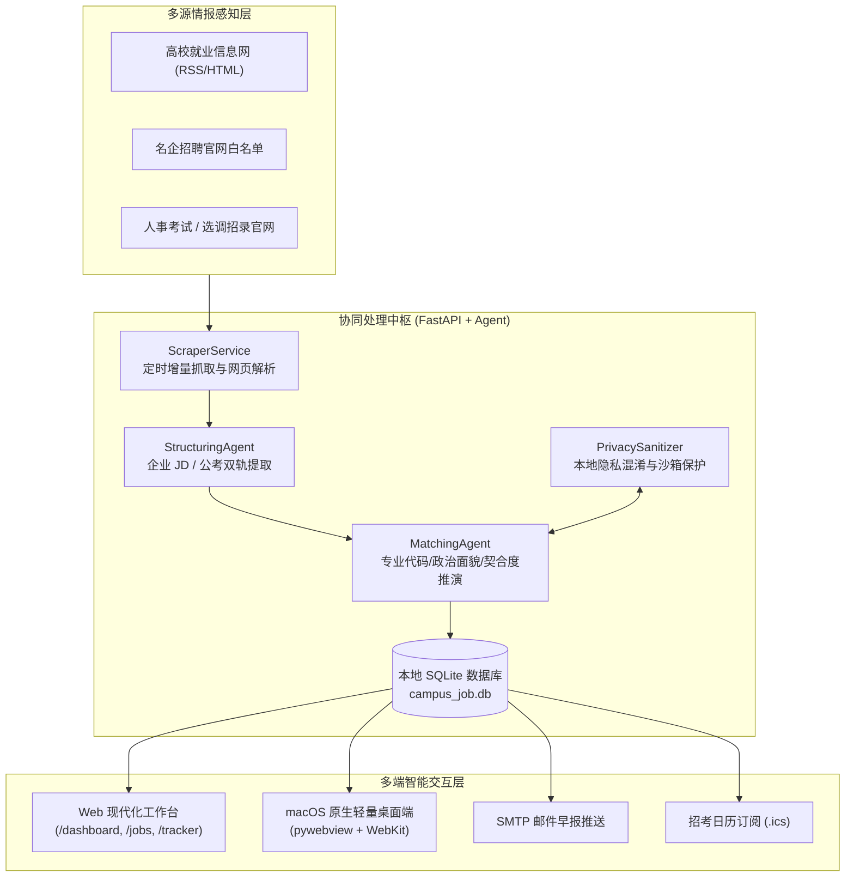

<div align="center">

# 🎓 CampusJob-Agent
### 高校校招与体制内招考智能协同系统 (Local-First 双轨求职工作台)

<p align="center">
  <a href="https://www.python.org/downloads/"></a>
  <a href="https://fastapi.tiangolo.com"></a>
  <a href="https://www.sqlite.org"></a>
  <a href="LICENSE"></a>
  <a href="https://github.com/astral-sh/ruff"></a>
  <a href="#-自动化测试矩阵"></a>
  
</p>

<p align="center">
  <strong>专为应届硕博毕业生量身打造的「企业大厂校招」与「体制内公考选调」双轨求职智能协同系统。</strong><br>
  集多源情报雷达、双 Schema 结构化解析、本地隐私脱敏沙箱、AI 契合度诊断、全流程投递看板与系统日历同步于一体。
</p>

[English](./README_EN.md) · [查看详细需求 PRD](./CampusJob_Agent_PRD_V1.0.md) · [商业化与分级设计](./docs/PRODUCT_TIERING_AND_MONETIZATION_PRD.md) · [贡献指南](./CONTRIBUTING.md)

</div>

---

## 💡 为什么需要 CampusJob-Agent？

每年有超过 1,100 万高校毕业生面临毕业求职。当代应届生普遍面临「企业校招冲刺」与「体制内考公/选调」的双轨兼顾挑战，随之而来的是三大核心困境：

1. **信息极度碎片化与漏网风险**：招聘简章散落在各高校就业网、微信公众号、大厂招聘官网及人事考试网中，人工盯盘耗时巨大，极易错过截止日期；
2. **资格门槛隐蔽且排查繁琐**：体制内选调与国企对专业代码目录、应届身份、政治面貌（党员）有强卡点，人工逐字核对繁琐易漏；
3. **商业求职软件的隐私泄露担忧**：传统求职工具常要求把简历明文上传云端服务器，求职行踪与敏感信息（手机号、身份证、住址）存在被滥用甚至泄露的风险。

**CampusJob-Agent** 坚持 **Local-First（本地隐私优先）** 架构设计：所有求职数据存储在本地 SQLite；个人简历通过本地正则与 AES 密钥沙箱混淆后，仅将脱敏摘要与 LLM 推理交互；兼具 Agent 深度推演能力与金融级的隐私安全防护。

---

## ✨ 核心特性矩阵

| 模块 | 功能亮点 | 核心能力描述 |
| :--- | :--- | :--- |
| 📡 **情报雷达** | 多源公告实时监听 | 支持高校就业网 RSS、指定大厂官网与招考人事网白名单，定时自动清洗聚合。 |
| 🧩 **双轨 Schema** | 结构化信息抽取 | 自动识别区分「企业校招」与「公考选调」，提取专业代码要求、薪资、笔面轮次及截止时间。 |
| 🛡️ **本地沙箱** | 个人数据零泄露 | 真实姓名、电话、邮箱、身份证及院校本地加密脱敏，LLM 仅接触混淆 Token。 |
| 🤖 **AI 诊断舱** | 0-100 契合度与雷达 | 生成 6 维能力雷达（研发/算法/系统/公文/组织/抗压），提供面试针对性押题与公考避坑。 |
| 📋 **投递看板** | 全生命周期协同 | 网申 ➔ 笔试 ➔ 一面 ➔ 二面 ➔ 终面 ➔ 录用，卡片式状态流转与 UTF-8 BOM CSV 导出。 |
| 📅 **招考日历** | 智能冲突检测与 iCal | 自动标注关键宣讲/笔试日程，一键订阅同步至 Apple Calendar / Google Calendar / Outlook。 |
| ✉️ **每日早报** | 自动化 SMTP 邮件直达 | 每天清晨自动汇总今日网申截止、高契合度新发岗位及笔面试备考锦囊。 |
| 🍏 **极轻桌面端** | 原生 WebKit 客户端 | 基于 Cocoa WebKit 原生轻量封装，启动毫秒级，告别 300MB+ 内存的 Electron 沉重负担。 |

---

## 🔒 隐私脱敏沙箱机制 (Local-First Sandbox)

我们把用户的隐私安全置于最高优先级：

```
┌────────────────────────────────────────────────────────────────────────┐
│                        本机隔离环境 (Local Device)                      │
│                                                                        │
│  [原始简历 PDF / TXT]                                                  │
│         │                                                              │
│         ▼                                                              │
│  ┌────────────────────────────────────────────────────────┐            │
│  │ PrivacySanitizer 本地脱敏算子 (正则识别 + AES 映射表)    │            │
│  │  • 姓名   ──>  [CANDIDATE_NAME]                        │            │
│  │  • 手机   ──>  [PHONE_1]                               │            │
│  │  • 邮箱   ──>  [EMAIL_1]                               │            │
│  │  • 身份证 ──>  [ID_CARD_1]                             │            │
│  │  • 院校   ──>  [UNIVERSITY_1]                          │            │
│  └────────────────────────────────────────────────────────┘            │
│         │                                                              │
│         ▼                                                              │
│  [脱敏后安全经历文本] ──────────────────────────┐                      │
│  [本地 SQLite 加密映射表]                       │ (仅脱敏文本外发)      │
│                                                │                      │
└────────────────────────────────────────────────┼───────────────────────┘
                                                 ▼
                                   ┌───────────────────────────┐
                                   │  外部推理大模型 (LLM)      │
                                   │  (DeepSeek / Qwen / GPT)  │
                                   │  零明文隐私接触，仅推演技能  │
                                   └───────────────────────────┘
```

---

## 🏗️ 系统架构设计



---

## 🚀 极速上手 (Quick Start)

### 1. 环境准备
- 操作系统：macOS / Linux / Windows
- Python：**3.11** 或 **3.12**
- 依赖管理工具：推荐使用 [uv](https://github.com/astral-sh/uv)（安装依赖极速秒级完成）

### 2. 获取代码与安装依赖
```bash
# 克隆本开源仓库
git clone https://github.com/beiningwuyou/CampusJob-Agent.git
cd CampusJob-Agent

# 使用 uv 一键安装依赖并创建虚拟环境
uv sync

# 如果你更习惯使用传统 pip:
# pip install -r requirements.txt (可选)
```

### 3. 配置本地环境变量
```bash
cp .env.example .env
```
根据需要编辑 `.env`（支持任意兼容 OpenAI 协议的推理模型，如 DeepSeek、通义千问等）：
```env
LLM_MODEL="deepseek/deepseek-chat"
LLM_API_KEY="your_api_key_here"
LLM_API_BASE="https://api.deepseek.com/v1"
```

### 4. 一键注入虚拟演示数据（开箱即用体验）
系统提供独立的脱敏种子脚本，无需真实数据即可瞬间生成完整的岗位、投递看板与 AI 诊断体验：
```bash
uv run python scripts/seed_demo_data.py
```

### 5. 启动系统

#### 方式 A：双击运行 macOS 原生桌面应用（推荐）
```bash
./run_desktop.sh
```
*或在本地自编译打包生成独立的 `.app` 应用：*
```bash
./scripts/build_macos_app.sh
# 生成的独立应用位于: dist/CampusJob-Agent.app
```

#### 方式 B：启动 Web 服务（浏览器访问）
```bash
uv run uvicorn app.main:app --host 127.0.0.1 --port 8000 --reload
```
打开浏览器访问各控制台：
- 📊 **总览仪表盘**：`http://127.0.0.1:8000/dashboard`
- 📡 **校招雷达中心**：`http://127.0.0.1:8000/jobs`
- 📋 **投递追踪看板**：`http://127.0.0.1:8000/tracker`
- 📅 **招考日程日历**：`http://127.0.0.1:8000/calendar`
- 🤖 **AI 顾问诊断舱**：`http://127.0.0.1:8000/advisory`
- ⚙️ **系统信源控制台**：`http://127.0.0.1:8000/settings`

---

## 🛡️ 本地数据隔离与开源发布安全审计

为杜绝任何用户本地真实数据、个人简历或环境变量被误提交，本项目配备了完善的隔离机制：

1. **三层物理隔离**：`.gitignore` 严格封禁 `data/*.db`、`data/resumes/*`、`.env` 及构建产物 `dist/`；
2. **发布前自动化看门狗核验**：
   在向远程仓库提交代码前，只需运行：
   ```bash
   bash scripts/pre_publish_check.sh
   ```
   该脚本将自动审查 staged 暂存区、扫描敏感路径及真实密钥，确保零泄露风险。

---

## 🧪 自动化测试矩阵

项目包含完整的单元测试与端到端接口测试：
```bash
uv run pytest -v
# ======================== 17 passed in 70s =========================
```

---

## 📂 项目目录结构

```
CampusJob-Agent/
├── app/                          # 核心后端逻辑
│   ├── agents/                   # 双轨提取 Agent、匹配 Agent、AI 顾问
│   ├── api/                      # FastAPI v1 RESTful API 路由
│   ├── core/                     # 本地隐私沙箱 (security.py)、全局配置与调度器
│   ├── db/                       # SQLAlchemy ORM 模型、仓储层与会话
│   ├── schemas/                  # 企业 JD 与体制内公考 Pydantic Schema
│   ├── services/                 # 爬虫解析、邮件早报、日历生成与脱敏服务
│   └── main.py                   # 应用启动入口
├── web/                          # Web 前端轻量工作台 (Tailwind + Vanilla JS)
├── scripts/                      # 自动化工具集
│   ├── build_macos_app.sh        # macOS 原生 .app 打包脚本
│   ├── seed_demo_data.py         # 脱敏虚拟演示数据初始化工具
│   └── pre_publish_check.sh      # 开源发布前安全看门狗核验脚本
├── tests/                        # 自动化测试矩阵 (pytest)
├── docs/                         # 商业化规划与技术文档
├── desktop.py                    # macOS WebKit 原生客户端外壳
├── run_desktop.sh                # 桌面端一键启动快捷脚本
├── .env.example                  # 环境变量安全示例模板
├── .gitignore                    # 强化的本地数据脱敏与文件隔离规则
├── pyproject.toml                # 项目元数据与依赖定义
├── LICENSE                       # MIT 开源许可证
├── CONTRIBUTING.md               # 社区贡献规范
├── SECURITY.md                   # 隐私沙箱与安全政策
└── README.md                     # 项目官方文档主页
```

---

## 🗺️ 路线图 (Roadmap)

- [x] **v1.0.0**：双轨 Schema 抽取、FastAPI 核心服务与本地隐私沙箱
- [x] **v1.1.0**：macOS WebKit 原生桌面端、ICS 日历同步与投递看板 CSV 导出
- [ ] **v1.2.0**：支持 Windows / Linux 跨平台原生桌面端打包
- [ ] **v1.3.0**：多智能体联合面试模拟舱（语音双向对练与打分反馈）
- [ ] **v1.4.0**：企业网申表单自动化辅助填报浏览器插件

---

## 🤝 参与贡献

我们热烈欢迎各类形式的贡献！
在提交 PR 之前，请阅读我们的 [贡献指南 (CONTRIBUTING.md)](./CONTRIBUTING.md)，并确保运行代码检查与测试：
```bash
uv run ruff check .
uv run pytest -v
bash scripts/pre_publish_check.sh
```

---

## 📄 开源许可证与免责声明

- 本项目基于 **[MIT License](./LICENSE)** 开源。
- **免责声明**：本项目内置的爬虫抓取逻辑仅供技术学习、学术交流与个人求职信息整理之用。使用者应自觉遵守目标站点之 `robots.txt` 规则与相关法律法规，不得用于商业化抓取或高频攻击行为。招聘公告之版权归各招聘主体及发布官网所有。
