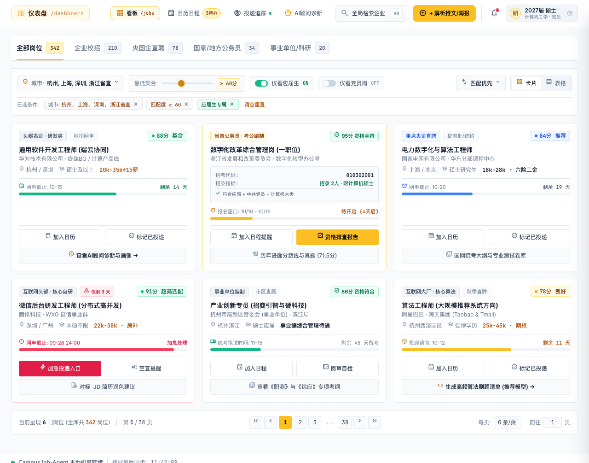
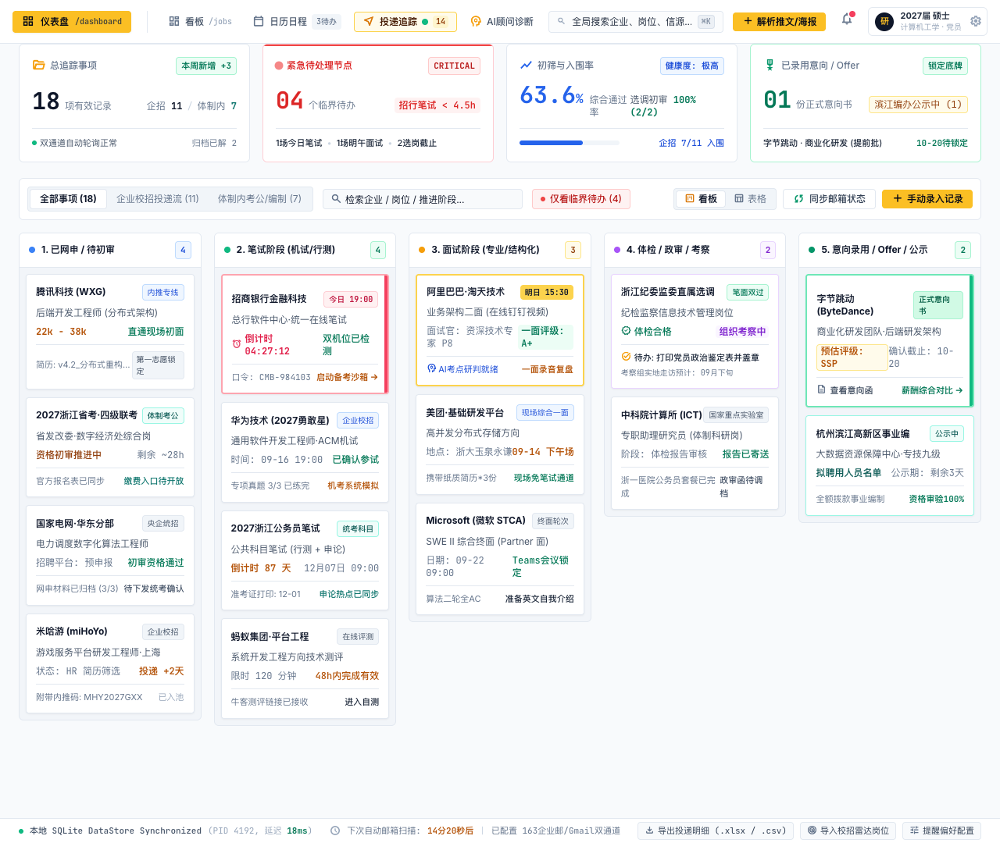
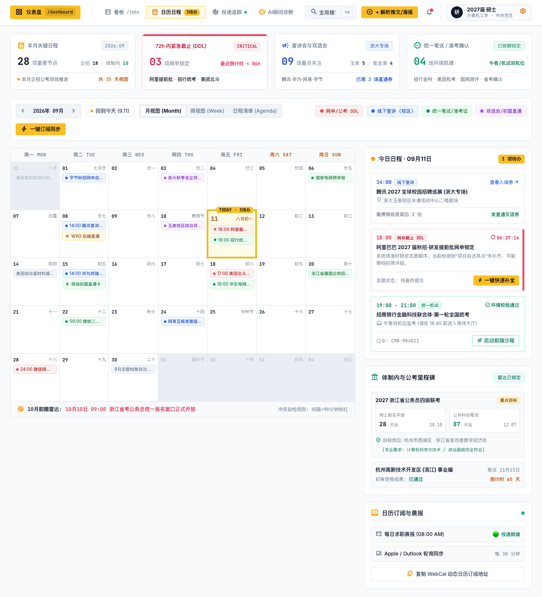
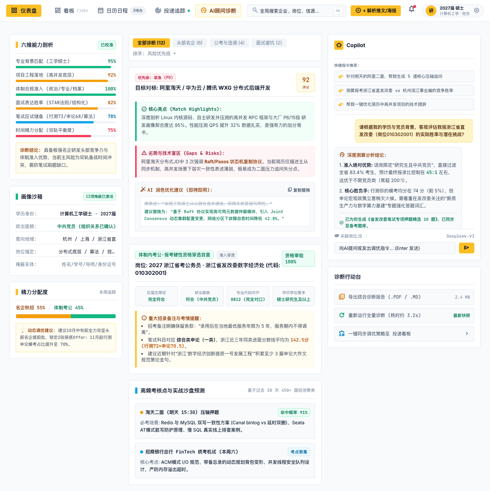
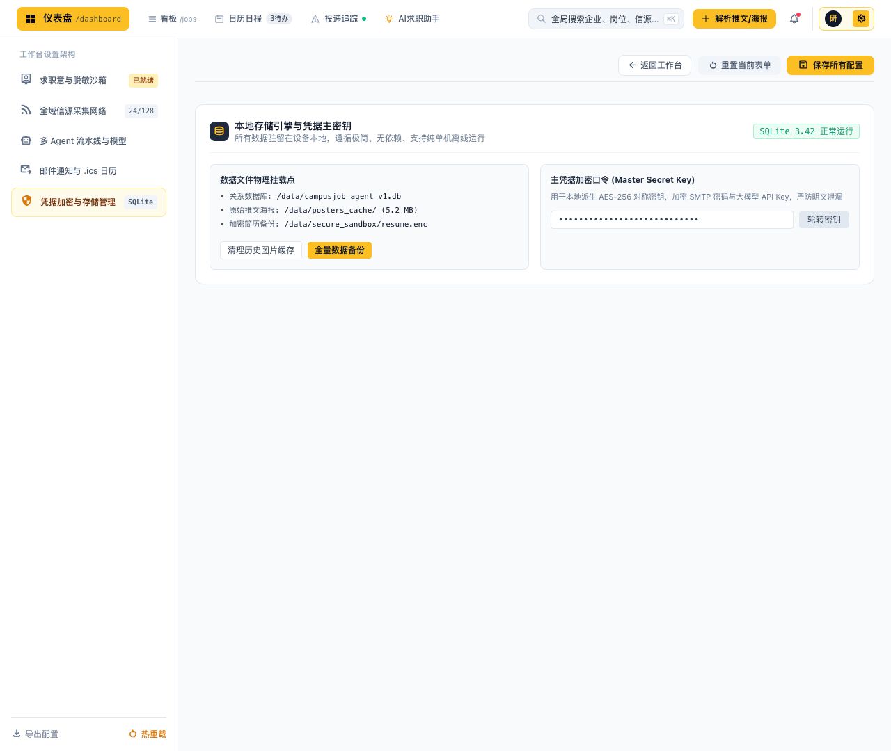
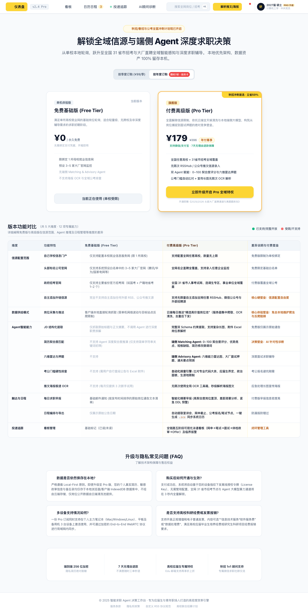
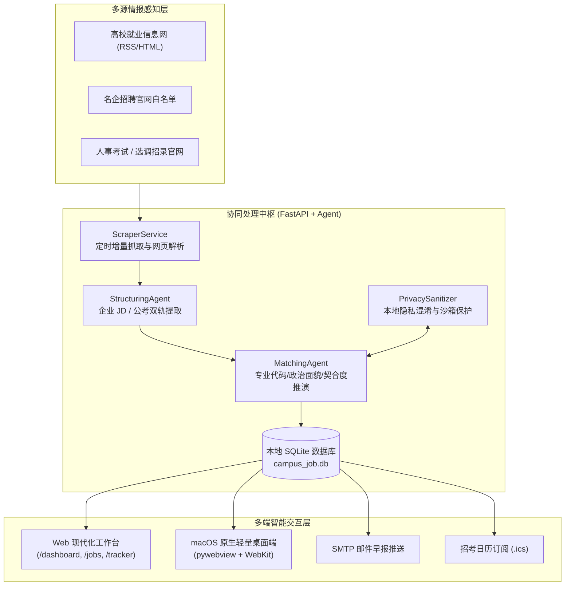

<div align="center">

# 🎓 CampusJob-Agent
### 高校校招与体制内招考智能协同系统 (Local-First 双轨求职工作台)

<p align="center">
  <a href="https://www.python.org/downloads/"></a>
  <a href="https://fastapi.tiangolo.com"></a>
  <a href="https://www.sqlite.org"></a>
  <a href="LICENSE"></a>
  <a href="https://github.com/astral-sh/ruff"></a>
  <a href="#-自动化测试矩阵"></a>
  
</p>

<p align="center">
  <strong>专为应届硕博毕业生量身打造的「企业大厂校招」与「体制内公考选调」双轨求职智能协同系统。</strong><br>
  集多源情报雷达、双 Schema 结构化解析、本地隐私脱敏沙箱、AI 契合度诊断、全流程投递看板与系统日历同步于一体。
</p>

[English](./README_EN.md) · [查看详细需求 PRD](./docs/CampusJob_Agent_PRD_V1.0.md) · [商业化与分级设计](./docs/PRODUCT_TIERING_AND_MONETIZATION_PRD.md) · [贡献指南](./.github/CONTRIBUTING.md)

<br/>


<p><em>▲ CampusJob-Agent 核心作战仪表盘：多源校招与招考态势感知、72h 紧急 DDL 倒计时与意向命中度分布</em></p>

</div>

---

## 💡 为什么需要 CampusJob-Agent？

每年有超过 1,100 万高校毕业生面临毕业求职。当代应届生普遍面临「企业校招冲刺」与「体制内考公/选调」的双轨兼顾挑战，随之而来的是三大核心困境：

1. **信息极度碎片化与漏网风险**：招聘简章散落在各高校就业网、微信公众号、大厂招聘官网及人事考试网中，人工盯盘耗时巨大，极易错过截止日期；
2. **资格门槛隐蔽且排查繁琐**：体制内选调与国企对专业代码目录、应届身份、政治面貌（党员）有强卡点，人工逐字核对繁琐易漏；
3. **商业求职软件的隐私泄露担忧**：传统求职工具常要求把简历明文上传云端服务器，求职行踪与敏感信息（手机号、身份证、住址）存在被滥用甚至泄露的风险。

**CampusJob-Agent** 坚持 **Local-First（本地隐私优先）** 架构设计：所有求职数据存储在本地 SQLite；个人简历通过本地正则与 AES 密钥沙箱混淆后，仅将脱敏摘要与 LLM 推理交互；兼具 Agent 深度推演能力与金融级的隐私安全防护。

---

## 📸 功能模块全景画廊

### 1. 📡 全域校招与招考雷达 (`/jobs`)
支持高校就业网 RSS、名企官网与公务员事业单位招聘白名单聚合，支持按**城市、契合度阈值、仅应届、仅党员**组合交叉过滤，一键加入日程与穿透排查资格。

<p align="center">
  
</p>

---

### 2. 📋 全生命周期五阶投递追踪看板 (`/tracker`)
覆盖 **已网申 ➔ 笔试阶段 ➔ 面试阶段 ➔ 体检/政审 ➔ 意向录用 (Offer)** 全流程。支持临界待办高亮、初筛入围率实时统计，并提供 **UTF-8 BOM CSV** 明细导出。

<p align="center">
  
</p>

---

### 3. 📅 招考日程日历与双向日程同步 (`/calendar`)
月视图 / 周视图自由切换，自动计算宣讲会、网申 DDL 与统考机试时间冲突。内置 **.ics 订阅源**，可一键将校招日程双向同步至 **Apple Calendar / Google Calendar / Outlook**。

<p align="center">
  
</p>

---

### 4. 🤖 AI 顾问诊断舱与实战沙盘决策 (`/advisory`)
基于本地沙箱解析出的经历摘要，由 Agent 深度推演：
- **六维能力剖析**：专业背景匹配、项目工程落地、体制合规准入、面试表达达胜率、笔试应试储备与精力分配度；
- **名企针对性面试押题**：自动预测技术追问盲区（如 Raft/Paxos 状态机、分布式双写一致性等）；
- **公考硬性资格穿透**：对照《普通高等学校本科/研究生专业目录》精准判定专业代码与选调准入资格。

<p align="center">
  
</p>

---

### 5. ⚙️ 存储主密钥与本地脱敏控制中心 (`/settings`)
纯单机离线运行，主凭据加密口令（Master Secret Key）由本地基于 SHA-256 与 AES-256 派生，密钥绝不上传云端，确保个人求职数据绝对自主可控。

<p align="center">
  
</p>

---

## 🔒 隐私脱敏沙箱机制 (Local-First Sandbox)

我们把用户的隐私安全置于最高优先级：

```
┌────────────────────────────────────────────────────────────────────────┐
│                        本机隔离环境 (Local Device)                      │
│                                                                        │
│  [原始简历 PDF / TXT]                                                  │
│         │                                                              │
│         ▼                                                              │
│  ┌────────────────────────────────────────────────────────┐            │
│  │ PrivacySanitizer 本地脱敏算子 (正则识别 + AES 映射表)    │            │
│  │  • 姓名   ──>  [CANDIDATE_NAME]                        │            │
│  │  • 手机   ──>  [PHONE_1]                               │            │
│  │  • 邮箱   ──>  [EMAIL_1]                               │            │
│  │  • 身份证 ──>  [ID_CARD_1]                             │            │
│  │  • 院校   ──>  [UNIVERSITY_1]                          │            │
│  └────────────────────────────────────────────────────────┘            │
│         │                                                              │
│         ▼                                                              │
│  [脱敏后安全经历文本] ──────────────────────────┐                      │
│  [本地 SQLite 加密映射表]                       │ (仅脱敏文本外发)      │
│                                                │                      │
└────────────────────────────────────────────────┼───────────────────────┘
                                                 ▼
                                   ┌───────────────────────────┐
                                   │  外部推理大模型 (LLM)      │
                                   │  (DeepSeek / Qwen / GPT)  │
                                   │  零明文隐私接触，仅推演技能  │
                                   └───────────────────────────┘
```

---

## 💎 产品形态与商业化规划 (Free vs Pro Tier)

本项目采用 **Local-First 隐私优先 + Cloud-Curated 云端精选** 的商业化架构体系：
- **免费基础版 (Free Tier)**：单校本地轮询，面向广大应届生开箱即用，支持绑定本校就业网与主要官网，本地单机基础匹配与通告推送；
- **付费高级版 (Pro Tier)**：解锁全网 31 省市招考与大厂无限源接入，享受云端每日清洗的高价值岗位池、全流程五阶泳道闭环、深度六维雷达与大厂真题预测。

<p align="center">
  
</p>

---

## 🏗️ 系统架构设计



---

## 🚀 极速上手 (Quick Start)

### 1. 环境准备
- 操作系统：macOS / Linux / Windows
- Python：**3.11** 或 **3.12**
- 依赖管理工具：推荐使用 [uv](https://github.com/astral-sh/uv)（安装依赖极速秒级完成）

### 2. 获取代码与安装依赖
```bash
# 克隆本开源仓库
git clone https://github.com/beiningwuyou/CampusJob-Agent.git
cd CampusJob-Agent

# 使用 uv 一键安装依赖并创建虚拟环境
uv sync

# 如果你更习惯使用传统 pip:
# pip install -r requirements.txt (可选)
```

### 3. 配置本地环境变量
```bash
cp .env.example .env
```
根据需要编辑 `.env`（支持任意兼容 OpenAI 协议的推理模型，如 DeepSeek、通义千问等）：
```env
LLM_MODEL="deepseek/deepseek-chat"
LLM_API_KEY="your_api_key_here"
LLM_API_BASE="https://api.deepseek.com/v1"
```

### 4. 一键注入虚拟演示数据（开箱即用体验）
系统提供独立的脱敏种子脚本，无需真实数据即可瞬间生成完整的岗位、投递看板与 AI 诊断体验：
```bash
uv run python scripts/seed_demo_data.py
```

### 5. 启动系统

#### 方式 A：双击运行 macOS 原生桌面应用（推荐）
```bash
./scripts/run_desktop.sh
```
*或在本地自编译打包生成独立的 `.app` 应用：*
```bash
./scripts/build_macos_app.sh
# 生成的独立应用位于: dist/CampusJob-Agent.app
```

#### 方式 B：启动 Web 服务（浏览器访问）
```bash
uv run uvicorn app.main:app --host 127.0.0.1 --port 8000 --reload
```
打开浏览器访问各控制台：
- 📊 **总览仪表盘**：`http://127.0.0.1:8000/dashboard`
- 📡 **校招雷达中心**：`http://127.0.0.1:8000/jobs`
- 📋 **投递追踪看板**：`http://127.0.0.1:8000/tracker`
- 📅 **招考日程日历**：`http://127.0.0.1:8000/calendar`
- 🤖 **AI 顾问诊断舱**：`http://127.0.0.1:8000/advisory`
- ⚙️ **系统信源控制台**：`http://127.0.0.1:8000/settings`

---

## 🛡️ 本地数据隔离与开源发布安全审计

为杜绝任何用户本地真实数据、个人简历或环境变量被误提交，本项目配备了完善的隔离机制：

1. **三层物理隔离**：`.gitignore` 严格封禁 `data/*.db`、`data/resumes/*`、`.env` 及构建产物 `dist/`；
2. **发布前自动化看门狗核验**：
   在向远程仓库提交代码前，只需运行：
   ```bash
   bash scripts/pre_publish_check.sh
   ```
   该脚本将自动审查 staged 暂存区、扫描敏感路径及真实密钥，确保零泄露风险。

---

## 🧪 自动化测试矩阵

项目包含完整的单元测试与端到端接口测试：
```bash
uv run pytest -v
# ======================== 17 passed in 70s =========================
```

---

## 📂 项目目录结构

```
CampusJob-Agent/
├── .github/                      # GitHub 社区治理与安全规范
│   ├── CONTRIBUTING.md           # 社区贡献指南
│   └── SECURITY.md               # 隐私沙箱与安全政策
├── app/                          # 核心后端逻辑 (FastAPI + Agent)
│   ├── agents/                   # 双轨提取 Agent、匹配 Agent、AI 顾问
│   ├── api/                      # RESTful API 路由 (/jobs, /tracker, /calendar 等)
│   ├── core/                     # 本地隐私沙箱 (security.py)、全局配置与调度器
│   ├── db/                       # SQLAlchemy ORM 模型、仓储层与会话
│   ├── schemas/                  # 企业 JD 与体制内公考 Pydantic Schema
│   ├── services/                 # 爬虫解析、邮件早报、日历生成与脱敏服务
│   └── main.py                   # 应用启动入口
├── web/                          # Web 前端轻量工作台 (Tailwind + Vanilla JS)
├── docs/                         # 技术规格文档、UI 原型与全景架构图集
│   ├── images/                   # 官方工作台全景高清截图 (7张高质感展示图)
│   ├── stitch/                   # Stitch 完整高保真原型与设计系统规范
│   ├── CampusJob_Agent_PRD_V1.0.md # 主产品需求文档 (PRD V1.0)
│   └── PRODUCT_TIERING_AND_MONETIZATION_PRD.md # 商业化分级规划 PRD
├── scripts/                      # 自动化工具箱 (构建/演示/审计)
│   ├── build_macos_app.sh        # macOS 原生 .app 打包脚本
│   ├── generate_icon.py          # 高清应用图标生成器
│   ├── pre_publish_check.sh      # 开源发布前安全看门狗核验脚本
│   ├── run_desktop.sh            # 桌面端原生一键启动快捷脚本
│   ├── sample_resume.txt         # 演示脱敏简历模板
│   └── seed_demo_data.py         # 脱敏虚拟演示数据初始化工具
├── tests/                        # 自动化测试矩阵 (pytest)
├── desktop.py                    # macOS WebKit 原生客户端外壳入口
├── pyproject.toml                # 项目元数据与依赖定义
├── uv.lock                       # uv 依赖版本精确锁定
├── requirements.txt              # pip 兼容依赖清单
├── .env.example                  # 环境变量安全示例模板
├── .gitignore                    # 强化的本地数据脱敏与文件隔离规则
├── LICENSE                       # MIT 开源许可证
├── README.md                     # 中文官方主页
└── README_EN.md                  # 英文官方主页
```

---

## 🗺️ 路线图 (Roadmap)

- [x] **v1.0.0**：双轨 Schema 抽取、FastAPI 核心服务与本地隐私沙箱
- [x] **v1.1.0**：macOS WebKit 原生桌面端、ICS 日历同步与投递看板 CSV 导出
- [ ] **v1.2.0**：支持 Windows / Linux 跨平台原生桌面端打包
- [ ] **v1.3.0**：多智能体联合面试模拟舱（语音双向对练与打分反馈）
- [ ] **v1.4.0**：企业网申表单自动化辅助填报浏览器插件

---

## 🤝 参与贡献

我们热烈欢迎各类形式的贡献！
在提交 PR 之前，请阅读我们的 [贡献指南 (CONTRIBUTING.md)](./.github/CONTRIBUTING.md)，并确保运行代码检查与测试：
```bash
uv run ruff check .
uv run pytest -v
bash scripts/pre_publish_check.sh
```

---

## 📄 开源许可证与免责声明

- 本项目基于 **[MIT License](./LICENSE)** 开源。
- **免责声明**：本项目内置的爬虫抓取逻辑仅供技术学习、学术交流与个人求职信息整理之用。使用者应自觉遵守目标站点之 `robots.txt` 规则与相关法律法规，不得用于商业化抓取或高频攻击行为。招聘公告之版权归各招聘主体及发布官网所有。
